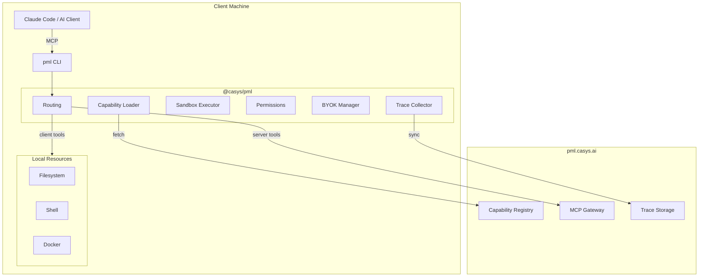
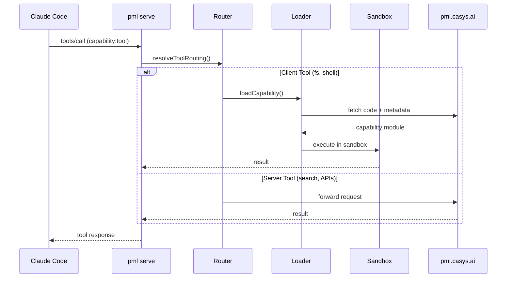
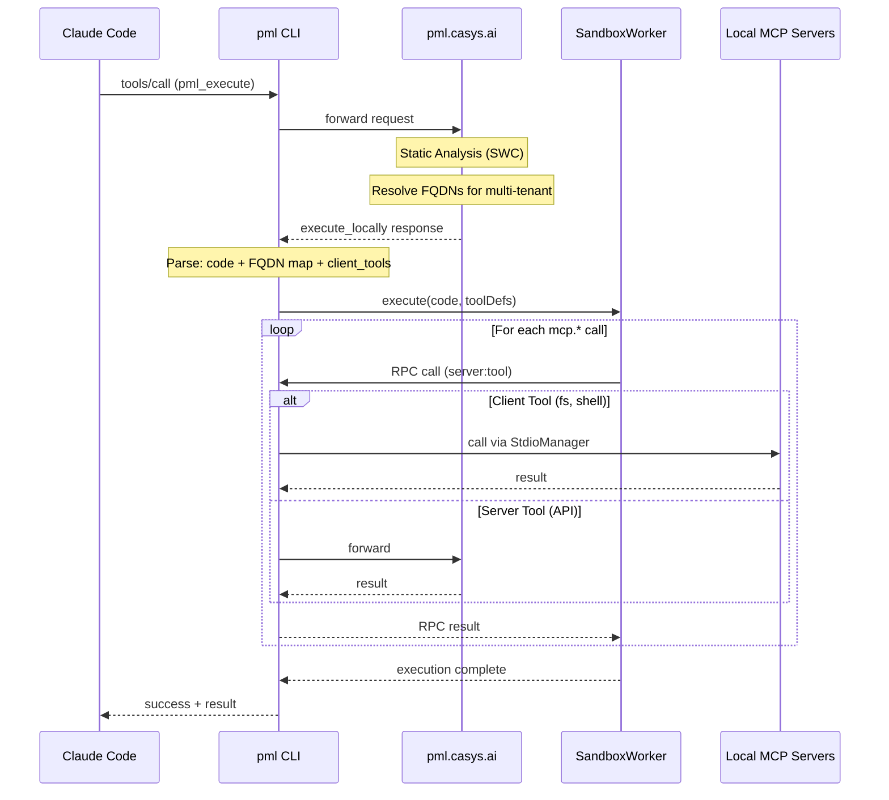
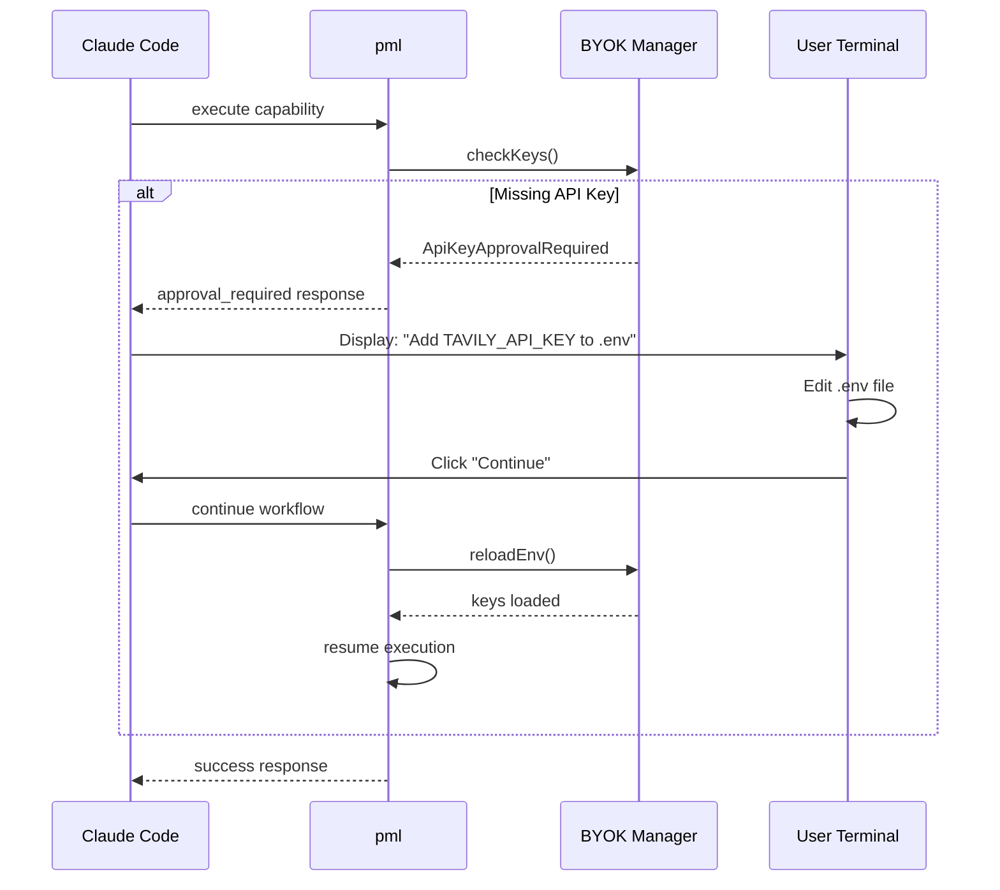
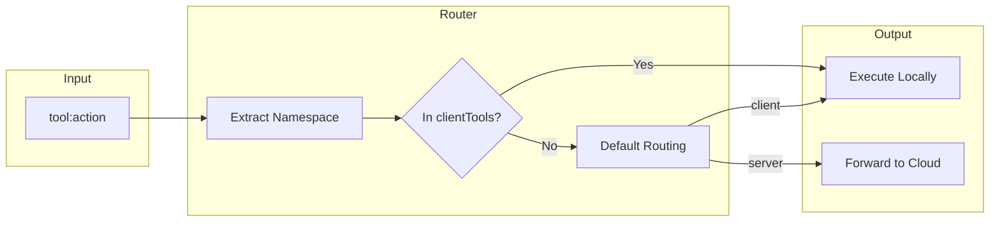
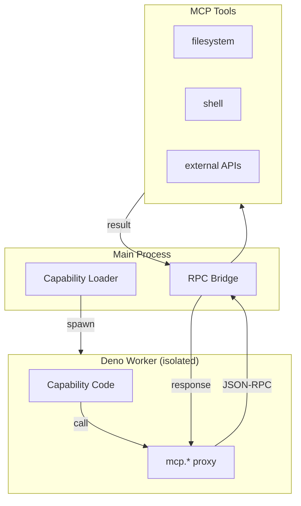
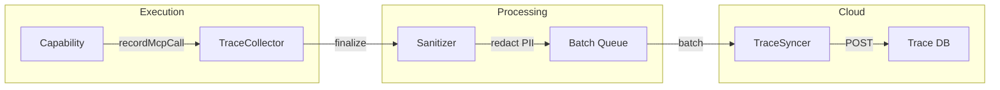
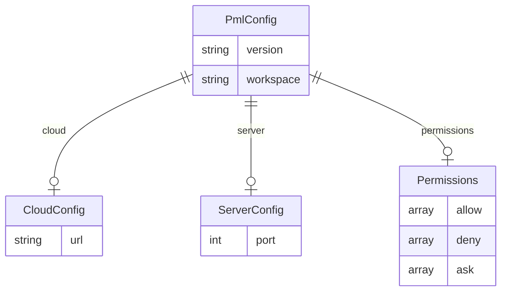
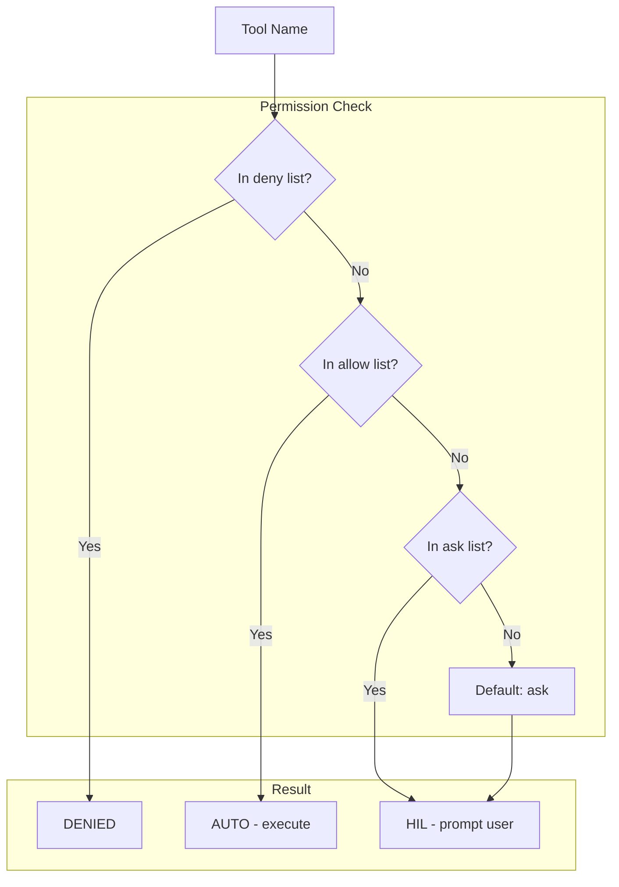

# Architecture

This document describes the architecture of `@casys/pml`, the lightweight CLI client for PML.

## System Overview



## Data Flow

### Tool Execution Flow



### Two-Phase Execution (`execute_locally`)

When a tool call involves capabilities with client-side tools (filesystem, shell), the server performs static analysis and returns an `execute_locally` response. The client then executes locally.



**The `execute_locally` Response** contains:

| Field | Description |
|-------|-------------|
| `status` | `"execute_locally"` |
| `code` | TypeScript code to execute |
| `client_tools` | Tools routed to client (e.g., `["filesystem", "shell"]`) |
| `tools_used` | Server-resolved FQDN map for multi-tenant (id → fqdn) |
| `workflowId` | Optional: for capability finalization |

**Why Two-Phase?**

1. **Security**: Server does static analysis to validate code structure
2. **Multi-tenant**: Server resolves FQDNs based on user's scope (org.project)
3. **Learning**: Server tracks what code was executed for capability learning
4. **Permissions**: Client handles HIL approval for dangerous tools

### HIL (Human-in-the-Loop) Flow



## Component Architecture

### Routing Layer

The router determines where each tool executes:



**Client tools** (execute on user's machine):
- `filesystem:*` - File operations
- `shell:*` - Command execution
- `docker:*` - Container management
- `git:*` - Version control

**Server tools** (forward to cloud):
- `tavily:*` - Web search
- `exa:*` - AI search
- Stateless computation capabilities

### Sandbox Execution (ADR-032)

Code runs in an isolated Deno worker with restricted permissions. The RPC bridge pattern is inspired by Cloudflare Code Mode and SandpackVM.

> **Note:** This documents the **client sandbox** (`SandboxWorker`). The server has a richer `WorkerBridge` with GraphRAG integration. See [MODULES.md](MODULES.md#client-vs-server-sandbox) for comparison.



**Security model:**
- Worker has `permissions: "none"` by default
- All I/O goes through RPC bridge
- Path validation prevents traversal attacks
- Workspace containment enforced

### RPC Protocol (ADR-032)

The Worker and Main process communicate via `postMessage` with typed messages:

```typescript
// Worker → Main: Tool call request
interface RPCCallMessage {
  type: "rpc_call";
  id: string;              // UUID for correlation
  server: string;          // "filesystem"
  tool: string;            // "read_file"
  args: Record<string, unknown>;
  parent_trace_id?: string; // For hierarchical tracing (ADR-041)
}

// Main → Worker: Tool call result
interface RPCResultMessage {
  type: "rpc_result";
  id: string;              // Matching request ID
  success: boolean;
  result?: unknown;
  error?: string;
}

// Main → Worker: Start execution
interface ExecuteMessage {
  type: "execute";
  code: string;
  tools: ToolDefinition[];
  context?: Record<string, unknown>;
}

// Worker → Main: Execution complete
interface ExecutionCompleteMessage {
  type: "execution_complete";
  success: boolean;
  result?: unknown;
  error?: string;
}
```

**Key insight:** Tracing happens natively in the RPC bridge, not via stdout parsing. Every tool call passes through the bridge, which captures timing and results automatically.

### Trace Collection (ADR-041)

Execution traces are collected and synced to the cloud for learning. Traces include hierarchical relationships via `parent_trace_id`.



**Hierarchical Tracing:**

Traces capture the call hierarchy, not just temporal order:

```text
capability_start (cap1, trace_id: "cap1")
├── tool_start (read_file, trace_id: "t1", parent_trace_id: "cap1")
│   └── tool_end (read_file, trace_id: "t1")
├── tool_start (write_file, trace_id: "t2", parent_trace_id: "cap1")
│   └── tool_end (write_file, trace_id: "t2")
└── capability_end (cap1, trace_id: "cap1")
```

This enables the cloud to learn true causal relationships (A calls B) vs temporal (A before B).

**Sanitization rules:**
- API keys redacted
- PII patterns masked
- Large payloads truncated (>10KB)
- File contents summarized

### BYOK Categories (ADR-040)

PML supports three categories of MCP tools:

| Category    | Examples                        | API Key Source              |
| ----------- | ------------------------------- | --------------------------- |
| **Managed** | filesystem, memory, fetch       | None (PML provides)         |
| **OAuth**   | github                          | User's OAuth token          |
| **BYOK**    | tavily, brave, openai, airtable | User provides in `.env`     |

**Data isolation model:**

```text
┌─────────────────────────────────────────────────────────────────┐
│  GLOBAL (shared - network effect)                               │
│  • Tool schemas from all MCPs                                   │
│  • Tool relationship graph (GraphRAG)                           │
│  • Learned capabilities (anonymized)                            │
├─────────────────────────────────────────────────────────────────┤
│  PRIVATE (isolated per user)                                    │
│  • Execution traces                                             │
│  • API keys (encrypted AES-256-GCM)                             │
│  • Workflow history                                             │
└─────────────────────────────────────────────────────────────────┘
```

## Configuration Files

### `.pml.json` Structure



### Permission Resolution



## Deployment Modes

### HTTP Mode (`pml serve`)

```text
┌─────────────────┐     HTTP/SSE      ┌─────────────────┐
│  Claude Code    │ ◄───────────────► │  pml serve      │
│  (MCP Client)   │    :3003/mcp      │  (HTTP Server)  │
└─────────────────┘                   └─────────────────┘
```

### Stdio Mode (`pml stdio`)

```text
┌─────────────────┐      stdio        ┌─────────────────┐
│  Claude Code    │ ◄───────────────► │  pml stdio      │
│  (MCP Client)   │   stdin/stdout    │  (MCP Server)   │
└─────────────────┘                   └─────────────────┘
```

## Related Architecture

For the full PML platform architecture including GraphRAG, DAG execution, and the capability learning system, see the main repository documentation at `@casys/mcp-gateway`.

## Architecture Decision Records

Key ADRs that inform this package's design:

| ADR | Title | Relevance |
|-----|-------|-----------|
| [ADR-032](../../../docs/adrs/ADR-032-sandbox-worker-rpc-bridge.md) | Sandbox Worker RPC Bridge | RPC protocol, Worker isolation |
| [ADR-040](../../../docs/adrs/ADR-040-multi-tenant-mcp-secrets-management.md) | Multi-tenant MCP & Secrets | BYOK categories, data isolation |
| [ADR-041](../../../docs/adrs/ADR-041-hierarchical-trace-tracking.md) | Hierarchical Trace Tracking | parent_trace_id, trace structure |
| [ADR-052](../../../docs/adrs/ADR-052-dynamic-capability-routing.md) | Dynamic Capability Routing | FQDN resolution, static analysis |
