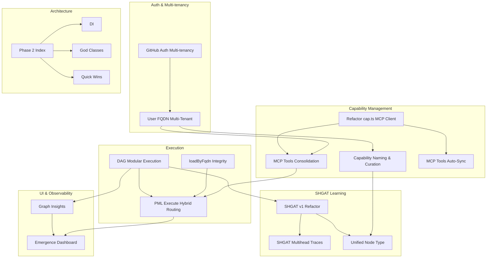

# Tech-Specs Dependency Analysis Report

**Generated:** 2026-01-19
**Scope:** `_bmad-output/implementation-artifacts/tech-specs/`

---

## 1. Dependency Graph



---

## 2. Thematic Clusters

### Cluster 1: Authentication & Multi-Tenancy 🔐
| Spec | Date | Status |
|------|------|--------|
| GitHub Auth Hybrid | 2025-12-27 | Ready |
| User FQDN Multi-Tenant | 2026-01-14 | ✅ Completed |
| loadByFqdn Integrity | 2026-01-15 | ✅ Complete |

**Impact:** Foundation layer - enables user isolation, API keys, scope-based routing

### Cluster 2: Capability Discovery & Management 📦
| Spec | Date | Status |
|------|------|--------|
| MCP Tools Consolidation | 2026-01-15 | ✅ Complete |
| Capability Naming & Curation | 2025-12-27 | Draft |
| MCP Tools Auto-Sync | 2026-01-16 | ✅ Complete |
| Refactor cap.ts MCP Client | 2026-01-12 | ✅ Complete |

**Impact:** Unified tool interface, better discoverability

### Cluster 3: DAG & Execution 🔄
| Spec | Date | Status |
|------|------|--------|
| Modular DAG Execution | 2025-12-26 | Ready |
| SHGAT v1 Refactor | 2025-01-XX | Draft |
| SHGAT Multihead Traces | 2025-12-24 | ✅ Complete |
| Unified Node Type | 2026-01-15 | ✅ Complete |
| PML Execute Hybrid Routing | 2026-01-09 | ✅ Complete |

**Impact:** Core ML/learning infrastructure, atomic operation learning

### Cluster 4: UI & Observability 📊
| Spec | Date | Status |
|------|------|--------|
| Graph Insights Panel | 2025-12-29 | In Progress |
| Emergence Dashboard | 2025-12-29 | Ready |
| User Docs Audit | 2026-01-08 | In Progress |

**Impact:** User-facing analytics, documentation completeness

### Cluster 5: Architecture Refactoring 🏗️
| Spec | Date | Status |
|------|------|--------|
| Phase 2 Index | 2025-12-29 | In Progress |
| Phase 2.1 DI | - | In Progress |
| Phase 2.2 God Classes | - | In Progress |
| Phases 2.3-3.4 | - | Pending |

**Impact:** Code quality, maintainability, testability

---

## 3. Entry Points (Not referenced by others)

| Spec | Reason |
|------|--------|
| GitHub Auth & Multi-Tenancy | Foundation auth layer |
| Architecture Refactor Phase 2 | Structural improvement |
| User Docs Audit | Documentation task |

---

## 4. Leaf Nodes (Don't reference others)

| Spec | Nature |
|------|--------|
| MCP Tools Auto-Sync | Completion of auto-discovery |
| Emergence Dashboard | Final UI layer |
| Unified Node Type | Type system unification |

---

## 5. Critical Path (High centrality)

| Spec | In | Out | Criticality |
|------|----|----|-------------|
| User FQDN Multi-Tenant | 1 | 3 | 🔴 CRITICAL |
| PML Execute Hybrid Routing | 2 | 1 | 🔴 CRITICAL |
| DAG Modular Execution | 0 | 3 | 🔴 CRITICAL |
| SHGAT v1 Refactor | 1 | 2 | 🔴 CRITICAL |
| MCP Tools Consolidation | 1 | 1 | 🟠 HIGH |

---

## 6. Implementation Order

### Phase 0: Foundation ✅
1. GitHub Auth & Multi-Tenancy
2. User FQDN Multi-Tenant

### Phase 1: Core Execution ✅
3. loadByFqdn Integrity
4. Modular DAG Execution
5. SHGAT v1 Refactor
6. Unified Node Type

### Phase 2: Tool Infrastructure ✅
7. Refactor cap.ts MCP Client
8. MCP Tools Consolidation
9. MCP Tools Auto-Sync

### Phase 3: Execution Routing ✅
10. PML Execute Hybrid Routing

### Phase 4: Capability Management 📋
11. Capability Naming & Curation (Draft - 32.5 days)

### Phase 5: UI & Polish 📋
12. SHGAT Multihead Traces
13. Graph Insights Dashboard
14. Emergence Dashboard
15. User Docs Audit

### Phase 6: Ongoing 🔧
- Architecture Refactor Phase 2-3

---

## 7. Critical Chains

### Auth → Routing Chain
```
Auth Multi-tenancy → User FQDN → MCP Consolidation → Hybrid Routing
```

### Learning Chain
```
DAG Modular → SHGAT v1 → Multihead Traces → Emergence Dashboard
```

### MCP Chain
```
cap.ts refactor → MCP Consolidation → Auto-Sync
```

---

## 8. Blocking Issues

| Issue | Specs Affected | Status |
|-------|---------------|--------|
| External MCP Tools in Hybrid | Hybrid Routing | ⚠️ OPEN |
| Collision Handling | Capability Naming | ⚠️ OPEN |
| LLM for Curation | Capability Naming | ⚠️ OPEN |

---

## 9. Summary

| Metric | Value |
|--------|-------|
| Total specs | 66 |
| Active development | 15 |
| Critical path | 6 |
| Thematic clusters | 5 |
| Implementation phases | 6 |
| High-risk specs | 4 |
