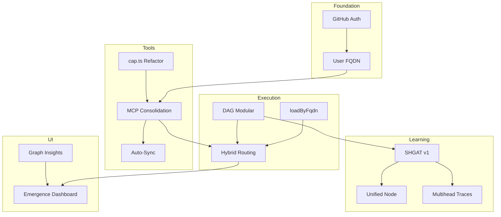

# Deep-Dive: Tech Specs Documentation

**Generated:** 2026-01-19
**Scope:** `_bmad-output/implementation-artifacts/tech-specs/`
**Files Analyzed:** 66
**Lines of Code Scanned:** 28,743

---

## Executive Summary

This deep-dive analyzes all technical specifications for the Casys PML project, mapping their relationships, implementation status, and integration with the codebase.

### Key Metrics

| Metric | Value |
|--------|-------|
| Total Tech-Specs | 66 files |
| Standalone Specs | 26 |
| Architecture Refactor Series | 13 |
| Modular DAG Series | 11 |
| SHGAT v1 Refactor Series | 10 |
| Archived | 5 |

### Implementation Status

| Status | Count | % |
|--------|-------|---|
| ✅ Completed/Done | 14 | 21% |
| 🔄 In Progress | 11 | 17% |
| 📦 Ready for Dev | 18 | 27% |
| 📋 Draft | 15 | 23% |
| 📝 Proposed | 5 | 8% |
| 🗄️ Archived | 5 | 8% |

---

## Table of Contents

1. [Thematic Clusters](#1-thematic-clusters)
2. [Dependency Graph](#2-dependency-graph)
3. [Implementation Mapping](#3-implementation-mapping)
4. [Critical Path Analysis](#4-critical-path-analysis)
5. [Risks & Blockers](#5-risks--blockers)
6. [Recommendations](#6-recommendations)
7. [File Inventory](#7-file-inventory)

---

## 1. Thematic Clusters

### 🔐 Cluster 1: Authentication & Multi-Tenancy

**Status:** 100% Complete ✅

| Spec | Date | Status | Implementation |
|------|------|--------|----------------|
| GitHub Auth Multi-Tenancy | 2025-12-27 | Ready | `src/server/auth/` |
| User FQDN Multi-Tenant | 2026-01-14 | ✅ Completed | `src/lib/user.ts`, Migration 039 |
| loadByFqdn Integrity | 2026-01-15 | ✅ Complete | `src/capabilities/capability-registry.ts` |
| Permission Matrix Refactor | 2025-12-16 | ✅ Completed | `src/capabilities/permission-escalation-handler.ts` |

**Impact:** Foundation layer enabling user isolation, API key management, and scope-based routing.

---

### 📦 Cluster 2: Capability Discovery & Management

**Status:** 95% Complete ✅

| Spec | Date | Status | Implementation |
|------|------|--------|----------------|
| MCP Tools Consolidation | 2026-01-15 | ✅ Complete | `discover-handler-facade.ts`, `admin-handler-facade.ts` |
| Refactor cap.ts MCP Client | 2026-01-12 | ✅ Complete | `cap-handler.ts`, `lib/std/cap.ts` |
| MCP Tools Auto-Sync | 2026-01-16 | ✅ Complete | `packages/pml/src/cli/stdio-command.ts` |
| Capability Naming & Curation | 2025-12-27 | 🔄 60% | `src/capabilities/fqdn.ts` (partial) |
| cap:merge | 2025-12-30 | ✅ Completed | `merge-capabilities.ts` |

**Impact:** Unified 3-tool API (pml:discover, pml:execute, pml:admin), auto-discovery at startup.

---

### 🔄 Cluster 3: DAG & Execution

**Status:** 90% Complete ✅

| Spec | Date | Status | Implementation |
|------|------|--------|----------------|
| PML Execute Hybrid Routing | 2026-01-09 | ✅ Complete | `code-execution-handler.ts`, `routing-resolver.ts` |
| SHGAT Multihead Traces | 2025-12-24 | ✅ Complete | `src/sandbox/executor.ts` |
| Unified Node Type | 2026-01-15 | ✅ Complete | `src/graphrag/types/`, `src/dag/types.ts` |
| Modular DAG Execution | 2025-12-26 | Ready | `modular-dag-execution/` series |
| SHGAT v1 Refactor | - | Draft | `shgat-v1-refactor/` series |

**Impact:** Server/client hybrid routing, DAG-based execution with SHGAT learning.

---

### 📊 Cluster 4: UI & Observability

**Status:** 50% In Progress 🔄

| Spec | Date | Status | Implementation |
|------|------|--------|----------------|
| Graph Insights Panel | 2025-12-29 | 🔄 60% | `src/api/graph-insights.ts` |
| Emergence Dashboard | 2025-12-29 | Ready | `src/web/components/` |
| User Docs Audit | 2026-01-08 | 🔄 In Progress | `docs/` |

**Impact:** User-facing analytics, CAS metrics visualization.

---

### 🏗️ Cluster 5: Architecture Refactoring

**Status:** In Progress 🔄

| Phase | Status | Focus |
|-------|--------|-------|
| 2.1 Dependency Injection | 🔄 In Progress | diod DI container |
| 2.2 God Classes | 🔄 In Progress | Split 10 classes >1000 LOC |
| 2.3 Type Splitting | ⏳ Pending | Monolithic type files |
| 2.4-2.7 | ⏳ Pending | Sandbox, patterns, testing, Deno native |
| 3.1-3.4 | ⏳ Pending | Execute handler, DI expansion, EventBus |

**Impact:** Code quality, maintainability, testability improvements.

---

## 2. Dependency Graph

### Critical Chains

1. **Auth Chain:** `GitHub Auth` → `User FQDN` → `MCP Consolidation` → `Hybrid Routing`
2. **Learning Chain:** `DAG Modular` → `SHGAT v1` → `Multihead Traces` → `Emergence Dashboard`
3. **MCP Chain:** `cap.ts refactor` → `MCP Consolidation` → `Auto-Sync`

---

## 3. Implementation Mapping

### Design Patterns Used

| Pattern | Files | Usage |
|---------|-------|-------|
| Handler Facade | 13 | `src/mcp/handlers/*.ts` |
| Use Case | 33 | `src/application/use-cases/` |
| Repository | 3 | CapabilityRegistry, CapabilityStore, IToolRepository |
| Dependency Injection | 🔄 | `src/infrastructure/di/` (in progress) |

### ADR Cross-References

| ADR | Title | Tech-Spec |
|-----|-------|-----------|
| ADR-018 | Command handlers minimalism | cap.ts refactor |
| ADR-025 | MCP streamable HTTP transport | Hybrid routing |
| ADR-033 | Capability code deduplication | FQDN multi-tenant |
| ADR-040 | Multi-tenant MCP secrets | GitHub auth |
| ADR-051 | Unified search simplification | MCP consolidation |
| ADR-052 | Dynamic capability routing | Hybrid routing |

### Code Without Tech-Specs

| Module | LOC | Documented In |
|--------|-----|---------------|
| `src/vector/` | 1,500+ | ADR-001, ADR-003 |
| `src/graphrag/` | 3,000+ | ADR-005, ADR-007 |
| `src/sandbox/` | 2,000+ | ADR-032, ADR-035 |
| `src/dag/` | 2,500+ | ADR-002, ADR-010 |
| `src/telemetry/` | 800+ | ADR-034, ADR-039 |

**Total undocumented:** ~15,000+ LOC

---

## 4. Critical Path Analysis

### Entry Points (Start Here)
- GitHub Auth & Multi-Tenancy
- Architecture Refactor Phase 2

### Leaf Nodes (End Points)
- MCP Tools Auto-Sync
- Emergence Dashboard
- Unified Node Type

### High Centrality (Critical)

| Spec | In | Out | Criticality |
|------|----|----|-------------|
| User FQDN Multi-Tenant | 1 | 3 | 🔴 CRITICAL |
| PML Execute Hybrid Routing | 2 | 1 | 🔴 CRITICAL |
| DAG Modular Execution | 0 | 3 | 🔴 CRITICAL |
| MCP Tools Consolidation | 1 | 1 | 🟠 HIGH |

---

## 5. Risks & Blockers

### Open Blockers

| Issue | Affected Specs | Status |
|-------|----------------|--------|
| External MCP Tools in Hybrid Routing | Hybrid Routing | ⚠️ OPEN |
| Collision Handling in FQDN | Capability Naming | ⚠️ OPEN |
| LLM Choice for Curation | Capability Naming | ⚠️ OPEN |

### Technical Debt

| Item | Priority | Impact |
|------|----------|--------|
| BUG-HIL-DEADLOCK | P2 | 5 tests blocked |
| God classes >1000 LOC | P2 | Maintainability |
| Undocumented modules | P3 | Developer onboarding |

---

## 6. Recommendations

### Immediate Actions

1. **Complete UI implementations** - Graph Insights and Emergence Dashboard are ready
2. **Finish Architecture Phase 2.1-2.2** - DI and god class splitting
3. **Document undocumented modules** - vector, graphrag, sandbox, dag

### Short-term (1-2 weeks)

4. **Resolve HIL-DEADLOCK** - Implement Deferred Escalation Pattern
5. **Complete Capability Naming** - Finish dns:query, dns:history, cap:fork
6. **Add traceability** - Link all source files to tech-specs or ADRs

### Long-term

7. **SHGAT v1 Refactor** - Major ML architecture redesign
8. **CasysDB GDS Integration** - Rust native graph database

---

## 7. File Inventory

### Standalone Specs (26)

| Date | Spec | Status |
|------|------|--------|
| 2025-12-10 | fresh-bff-refactoring | Ready |
| 2025-12-10 | open-core-workspace | ✅ Completed |
| 2025-12-12 | smithery-mcp-loader | Ready |
| 2025-12-16 | dag-capability-learning | Draft |
| 2025-12-16 | hil-permission-escalation-fix | Partial |
| 2025-12-16 | permission-matrix-refactor | ✅ Completed |
| 2025-12-17 | pml-discover-api | Draft |
| 2025-12-19 | std-server-concurrency | ✅ Done |
| 2025-12-23 | mcp-agent-nodes | Draft |
| 2025-12-24 | shgat-multihead-traces | ✅ Complete |
| 2025-12-27 | capability-naming-curation | 🔄 Partial |
| 2025-12-27 | github-auth-multitenancy | Ready |
| 2025-12-29 | emergence-dashboard | Ready |
| 2025-12-29 | graph-insights-panel | 🔄 In Progress |
| 2025-12-30 | cap-merge | ✅ Completed |
| 2025-12-30 | inline-literal-parameterization | ✅ Implemented |
| 2025-12-30 | user-fk-refactor | Proposed |
| 2026-01-03 | casysdb-gds-integration | Draft |
| 2026-01-08 | user-docs-audit | 🔄 In Progress |
| 2026-01-09 | pml-execute-hybrid-routing | ✅ Complete |
| 2026-01-12 | refactor-cap-mcp-client | ✅ Complete |
| 2026-01-14 | user-fqdn-multi-tenant | ✅ Completed |
| 2026-01-15 | complete-loadbyfqdn-integrity-migration | ✅ Complete |
| 2026-01-15 | mcp-tools-consolidation | ✅ Complete |
| 2026-01-15 | unified-node-type | ✅ Complete |
| 2026-01-16 | mcp-tools-auto-sync | ✅ Complete |

### Series: Architecture Refactor Phase 2 (13)

| File | Status |
|------|--------|
| index.md | 🔄 In Progress |
| phase-2.1-dependency-injection.md | 🔄 In Progress |
| phase-2.2-god-classes.md | 🔄 In Progress |
| phase-2.3-type-splitting.md | ⏳ Pending |
| phase-2.4-sandbox.md | ⏳ Pending |
| phase-2.5-patterns.md | ⏳ Pending |
| phase-2.6-testing.md | ⏳ Pending |
| phase-2.7-deno-native.md | ⏳ Pending |
| phase-3.1-execute-handler-usecases.md | ⏳ Pending |
| phase-3.2-di-expansion.md | ⏳ Pending |
| phase-3.3-god-classes-round2.md | ⏳ Pending |
| phase-3.4-eventbus-injection.md | ⏳ Pending |
| quick-wins.md | Reference |

### Series: Modular DAG Execution (11)

| File | Status |
|------|--------|
| index.md | Ready |
| impact-analysis.md | Reference |
| loop-abstraction.md | Draft |
| modular-code-execution.md | Draft |
| modular-operations-implementation.md | Draft |
| operation-embeddings.md | Draft |
| parseable-code-patterns.md | Draft |
| phase-2b-impl-plan.md | Draft |
| pure-operations-permissions.md | Draft |
| shgat-learning-and-dag-edges.md | Draft |
| two-level-dag-architecture.md | Draft |

### Series: SHGAT v1 Refactor (10)

| File | Status |
|------|--------|
| 00-overview.md | Draft |
| 01-data-model.md | Draft |
| 02-hierarchy-computation.md | Draft |
| 03-incidence-structure.md | Draft |
| 04-message-passing.md | Draft |
| 05-parameters.md | Draft |
| 06-scoring-api.md | Draft |
| 07-training.md | Draft |
| 08-migration.md | Draft |
| 09-testing.md | Draft |
| progress.md | Tracking |

### Archived (5)

| File | Type |
|------|------|
| bug-parallel-execution-tracking.md | Bug report |
| integration-test-plan-mcp-gateway.md | Test plan |
| integration-test-plan-summary.md | Test plan |
| review-controlled-executor-refactor.md | Code review |
| tech-spec-failing-tests-inventory.md | Inventory |

---

## Related Documents

- [Tech-Specs Inventory (JSON)](./deep-dive-tech-specs-inventory.json)
- [Dependency Analysis](./deep-dive-tech-specs-relationships.md)
- [Code Mapping](./deep-dive-tech-specs-code-mapping.md)

---

**Generated by:** BMAD Document Project Workflow
**Workflow Version:** 1.2.0
