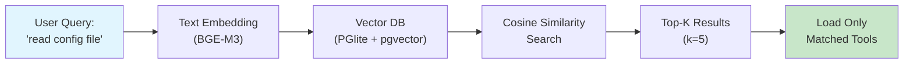

# Story 2.3: Notebook 02 - Context Optimization

Status: done

## Story

As a **user**, I want **to understand how vector search reduces context**, so that **I see the first solution mechanism in action**.

## Acceptance Criteria

1. **Explication Vector Search:**
   - Comment fonctionne l'embedding et la recherche vectorielle
   - Diagramme Mermaid montrant le flow: text → embedding → similarity → results

2. **Demo Live:**
   - Charge les 3 MCP servers (filesystem, memory, sequential-thinking)
   - Montre tous les outils disponibles (~25 outils)
   - Query "read a file" → retourne top 3 outils pertinents
   - Affiche réduction: "25 tools → 3 tools = 88% reduction"

3. **Métriques Visuelles:**
   - Tokens avant/après avec `compareMetrics()` de lib/metrics.ts
   - Progress bar montrant la réduction de contexte avec `progressBar()`

4. **Checkpoint:**
   - Exercice interactif "trouver les bons outils pour X"
   - Ou quiz simple sur les concepts appris

## Tasks / Subtasks

- [x] Task 1: Améliorer la section explicative (AC: #1)
  - [x] Ajouter un diagramme Mermaid du flow vector search via `displayMermaid()`
  - [x] Clarifier les étapes: Texte → Embedding → Index → Query → Results

- [x] Task 2: Implémenter la Demo Live avec vrais MCP servers (AC: #2)
  - [x] Remplacer les outils simulés par de vrais appels MCP si gateway disponible
  - [x] Ajouter fallback gracieux si gateway non disponible (garder simulation)
  - [x] Afficher clairement le nombre d'outils chargés vs utilisés
  - [x] Utiliser `reductionSummary()` de lib/metrics.ts pour "25 tools → 3 tools"

- [x] Task 3: Améliorer les métriques visuelles (AC: #3)
  - [x] Ajouter `progressBar()` pour montrer 45% → <5% visuellement
  - [x] Utiliser `compareMetrics()` pour tableau before/after complet
  - [x] Assurer cohérence avec les patterns de Story 2.2

- [x] Task 4: Ajouter Checkpoint de validation (AC: #4)
  - [x] Créer un exercice interactif ou quiz simple
  - [x] Vérifier compréhension des concepts clés

- [x] Task 5: Review et validation finale (AC: #1-4)
  - [x] Exécuter notebook complet dans Jupyter
  - [x] Vérifier tous les outputs et visualisations
  - [x] S'assurer que le notebook suit la structure standard

## Dev Notes

### Current State Analysis

**Fichier existant:** `playground/notebooks/02-context-optimization.ipynb`

Le notebook existe déjà avec 11 cellules, mais utilise principalement des simulations. Il faut:
1. Ajouter des visualisations Mermaid
2. Améliorer avec vrais appels MCP (avec fallback)
3. Utiliser les helpers de lib/metrics.ts
4. Ajouter un checkpoint de validation

**Gap Analysis:**

| AC | Requis | État actuel | Action |
|----|--------|-------------|--------|
| #1 | Explication + Mermaid diagram | ✅ Texte OK, ❌ Pas de Mermaid | Ajouter displayMermaid() |
| #2 | Demo Live avec vrais MCP | ⚠️ Simulation uniquement | Ajouter vrais appels + fallback |
| #3 | Métriques visuelles | ⚠️ Console.log basique | Utiliser compareMetrics(), progressBar() |
| #4 | Checkpoint exercice | ❌ Absent | Ajouter section checkpoint |

### Architecture Constraints

**Libs disponibles (Epic 1 DONE):**

```typescript
// lib/init.ts - Story 1.5 DONE
import { ensurePlaygroundReady, InitStatus } from "../lib/init.ts";

// lib/viz.ts - Story 1.6 DONE
import { displayMermaid, dagToMermaid } from "../lib/viz.ts";

// lib/metrics.ts - Story 1.7 DONE
import { compareMetrics, progressBar, speedupChart, reductionSummary } from "../lib/metrics.ts";
```

**Notebook current structure (11 cells):**

1. Title + Learning Objectives (markdown)
2. The Idea: Load Only What You Need (markdown)
3. How Vector Search Works (markdown) - Texte seulement
4. Tool simulation setup (typescript) - 13 outils simulés
5. Search function simulation (typescript)
6. Measuring the Savings intro (markdown)
7. Context comparison (typescript) - Console.log basique
8. Real Implementation intro (markdown)
9. Real MCP call attempt (typescript) - Fallback si gateway down
10. Technical Stack table (markdown)
11. Quick Check + Next link (markdown)

### Improvements Required

**AC #1 - Explication + Mermaid:**
- Ajouter cellule avec diagramme Mermaid:


**AC #2 - Demo Live:**
- Garder simulation comme fallback
- Tenter connexion gateway si disponible
- Afficher clairement les résultats avec `reductionSummary()`

**AC #3 - Métriques:**
- Remplacer les console.log par:
  - `progressBar(traditionalPct, 100, "Traditional")`
  - `progressBar(onDemandPct, 100, "On-Demand")`
  - `compareMetrics(before, after)`

**AC #4 - Checkpoint:**
- Ajouter section finale avec exercice:
  - "Given these 5 intents, which tools would vector search return?"
  - Ou cellule interactive où user peut tester ses propres queries

### Testing Strategy

**Manual Validation:**

1. Ouvrir notebook dans VS Code Jupyter
2. Exécuter toutes les cellules séquentiellement
3. Vérifier outputs:
   - Mermaid diagram s'affiche correctement
   - Metrics helpers produisent output formaté
   - Demo fonctionne (gateway ou fallback)
   - Checkpoint est interactif/compréhensible

**No Unit Tests Required:**
- Story est modification notebook (fichier .ipynb)
- Validation manuelle par exécution

### Project Structure Notes

**Target File:**
- `playground/notebooks/02-context-optimization.ipynb` (modification)

**Dependencies from Epic 1:**
- Story 1.6: `lib/viz.ts` avec `displayMermaid()` ✅ DONE
- Story 1.7: `lib/metrics.ts` avec `progressBar()`, `compareMetrics()`, `reductionSummary()` ✅ DONE

**Prerequisites:** Story 2.2 (Notebook 01 The Problem) done

### Previous Story Intelligence (2.2)

**Learnings from Story 2.2:**
- Utiliser `displayMermaid()` pour les diagrammes via Kroki API
- Les helpers de lib/metrics.ts sont fonctionnels et produisent output ASCII propre
- Format notebook: Title → Learning Objectives → Sections → Checkpoint → Next
- Validation manuelle par exécution dans VS Code Jupyter
- Simulation setTimeout est acceptable pour démo pédagogique

**Patterns établis:**
- Import style: `import { helper } from "../lib/module.ts";`
- Output: `console.log()` avec formatage ASCII pour compatibilité
- Fallback gracieux si services non disponibles
- Cellules markdown claires entre sections de code

### Mermaid Diagram for Vector Search Flow



### References

- [Source: docs/PRD-playground.md#FR010] - Context optimization 45% → <5%
- [Source: docs/epics-playground.md#Story-2.3] - Acceptance criteria
- [Source: playground/notebooks/02-context-optimization.ipynb] - Fichier à modifier
- [Source: playground/lib/viz.ts] - Helper displayMermaid
- [Source: playground/lib/metrics.ts] - Helpers progressBar, compareMetrics, reductionSummary
- [Source: docs/sprint-artifacts/playground/2-2-notebook-01-the-problem.md] - Previous story patterns

## Dev Agent Record

### Context Reference

<!-- Path(s) to story context XML will be added here by context workflow -->

### Agent Model Used

Claude Opus 4.5 (claude-opus-4-5-20251101)

### Debug Log References

### Completion Notes List

- ✅ Added Mermaid diagram visualizing vector search flow (Query → Embedding → VectorDB → Similarity → Results → Load)
- ✅ Implemented live MCP gateway connection with graceful fallback to simulation
- ✅ Enhanced metrics visualization using `progressBar()`, `compareMetrics()`, and `reductionSummary()` from lib/metrics.ts
- ✅ Added interactive checkpoint with `predictTools()` function for hands-on learning
- ✅ Added quiz section with 3 questions to verify understanding
- ✅ Notebook structure follows established pattern: Title → Learning Objectives → Sections → Checkpoint → Next

### File List

- `playground/notebooks/02-context-optimization.ipynb` (modified)

## Change Log

| Date | Change | Author |
|------|--------|--------|
| 2025-12-15 | Story created with comprehensive dev context | Claude Opus 4.5 |
| 2025-12-15 | Implemented all ACs: Mermaid diagram, live MCP demo with fallback, metrics helpers, interactive checkpoint | Claude Opus 4.5 |
| 2025-12-15 | Code Review: Fixed gateway port 3000→3003, Mermaid colors for dark mode, validated all notebook outputs | Claude Opus 4.5 |
