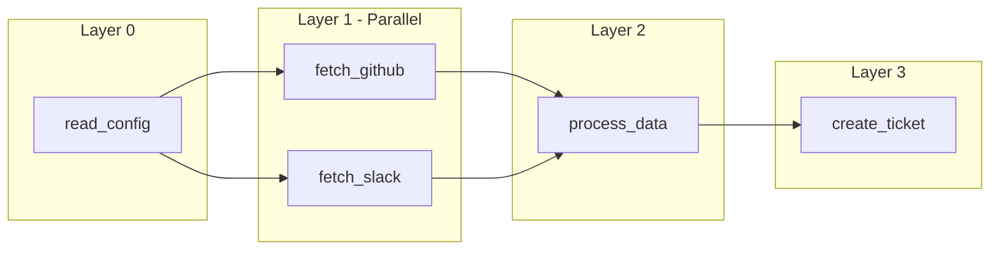
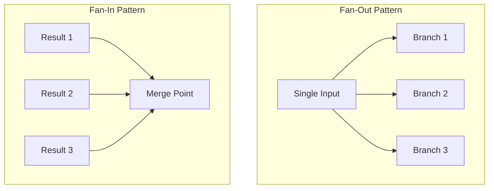

# Story 2.4: Notebook 03 - DAG Execution

Status: Ready for Review

## Story

As a **user**, I want **to see DAG parallelization in action**, so that **I understand how workflows are optimized for faster execution**.

## Acceptance Criteria

1. **Explication DAG:**
   - Expliquer DAG (Directed Acyclic Graph), dépendances, et niveaux d'exécution
   - Diagramme Mermaid montrant le concept de parallélisation par layers

2. **Demo Live:**
   - Workflow avec branches parallèles (filesystem + memory + time simulé)
   - Visualisation DAG avec `displayDag()` ou `displayLayers()` de lib/viz.ts
   - Exécution séquentielle (mesure temps réel)
   - Exécution parallèle (mesure temps réel)
   - Affiche speedup avec `speedupChart()` de lib/metrics.ts

3. **Interactive:**
   - User peut modifier le workflow et re-exécuter
   - Ou proposer plusieurs exemples de workflows à tester

4. **Checkpoint:**
   - Exercice "dessiner le DAG d'un workflow donné"
   - Ou quiz sur l'identification des dépendances et opportunités de parallélisation

## Tasks / Subtasks

- [x] Task 1: Créer notebook 03-dag-execution.ipynb (AC: #1)
  - [x] Structure: Title → Learning Objectives → Sections → Checkpoint → Next
  - [x] Section explicative DAG avec diagramme Mermaid via `displayMermaid()`
  - [x] Expliquer: dépendances, layers, fan-in/fan-out patterns

- [x] Task 2: Implémenter Demo Live avec vraie exécution (AC: #2)
  - [x] Définir un workflow exemple avec 5 tâches et dépendances
  - [x] Utiliser `displayDag()` pour visualiser le workflow
  - [x] Utiliser `displayLayers()` pour montrer les layers d'exécution parallèle
  - [x] Implémenter exécution séquentielle avec mesure de temps (Promise.all en série)
  - [x] Implémenter exécution parallèle avec mesure de temps (Promise.all par layer)
  - [x] Utiliser `speedupChart()` pour afficher le speedup obtenu

- [x] Task 3: Ajouter interactivité (AC: #3)
  - [x] Créer cellule où l'utilisateur peut modifier les dépendances
  - [x] Ou proposer 3 workflows différents à tester (Star, Linear, Diamond patterns)
  - [x] Afficher résultats différents selon le workflow choisi

- [x] Task 4: Ajouter Checkpoint de validation (AC: #4)
  - [x] Quiz ou exercice interactif sur les DAG
  - [x] Demander à l'utilisateur d'identifier les layers d'un workflow donné

- [x] Task 5: Review et validation finale (AC: #1-4)
  - [x] Exécuter notebook complet dans VS Code Jupyter
  - [x] Vérifier tous les outputs et visualisations Mermaid
  - [x] S'assurer que les temps mesurés sont réalistes (pas simulés artificiellement)

## Dev Notes

### Current State Analysis

**Fichier cible:** `playground/notebooks/03-dag-execution.ipynb` (À CRÉER - n'existe pas)

Le notebook 03 doit être créé from scratch en suivant les patterns établis dans 00, 01, et 02.

### Architecture Constraints

**Libs disponibles (Epic 1 DONE):**

```typescript
// lib/viz.ts - Story 1.6 DONE
import {
  displayMermaid,
  displayDag,
  displayLayers,
  dagToMermaid,
  layersToMermaid,
  dagStats,
  type DAGTask,
  type DAGWorkflow
} from "../lib/viz.ts";

// lib/metrics.ts - Story 1.7 DONE
import {
  progressBar,
  speedupChart,
  compareMetrics,
  reductionSummary
} from "../lib/metrics.ts";
```

**Types DAG disponibles dans lib/viz.ts:**

```typescript
interface DAGTask {
  id: string;
  tool_name?: string;
  dependencies?: string[];
}

interface DAGWorkflow {
  id?: string;
  tasks: DAGTask[];
}
```

**Fonctions visualisation DAG:**

- `dagToMermaid(dag: DAGWorkflow)` → génère code Mermaid graph TD
- `layersToMermaid(layers: DAGTask[][])` → génère subgraphs par layer
- `displayDag(dag)` → affiche SVG dans Jupyter
- `displayLayers(layers)` → affiche layers comme subgraphs
- `dagStats(dag)` → stats textuelles (total tasks, entry points, etc.)

### Notebook Standard Structure

Basé sur notebooks 00-02, le format standard est:

1. **Markdown Title + Learning Objectives** (cell 1)
2. **Concept Explanation** avec diagrammes Mermaid
3. **Demo Code Cells** avec vrais appels ou simulations gracieuses
4. **Metrics/Visualization Cells** utilisant lib/metrics.ts
5. **Checkpoint/Quiz** (cell final avant Next)
6. **Next Link** vers notebook suivant

### Example DAG Workflow

**Workflow exemple recommandé** (5 tâches, 3 layers):

```
Layer 0: [A: read_config]          → Entrée
Layer 1: [B: fetch_github, C: fetch_slack]  → Parallèle (dépendent de A)
Layer 2: [D: process_data]          → Fan-in (dépend de B et C)
Layer 3: [E: create_ticket]         → Sortie (dépend de D)
```

**Structure DAG:**
```typescript
const exampleDAG: DAGWorkflow = {
  id: "demo-workflow",
  tasks: [
    { id: "A", tool_name: "read_config", dependencies: [] },
    { id: "B", tool_name: "fetch_github", dependencies: ["A"] },
    { id: "C", tool_name: "fetch_slack", dependencies: ["A"] },
    { id: "D", tool_name: "process_data", dependencies: ["B", "C"] },
    { id: "E", tool_name: "create_ticket", dependencies: ["D"] },
  ]
};
```

**Temps simulés réalistes:**
- read_config: 200ms (lecture fichier)
- fetch_github: 800ms (API call)
- fetch_slack: 600ms (API call)
- process_data: 300ms (traitement local)
- create_ticket: 500ms (API call)

**Calculs attendus:**
- Séquentiel: 200 + 800 + 600 + 300 + 500 = 2400ms
- Parallèle: 200 + max(800,600) + 300 + 500 = 1800ms
- Speedup: 2400/1800 = 1.33x

### Topological Sort Algorithm

Pour démontrer la parallélisation, implémenter un tri topologique simple:

```typescript
function topologicalSort(dag: DAGWorkflow): DAGTask[][] {
  const layers: DAGTask[][] = [];
  const completed = new Set<string>();
  const remaining = [...dag.tasks];

  while (remaining.length > 0) {
    const layer = remaining.filter(task =>
      (task.dependencies || []).every(dep => completed.has(dep))
    );

    if (layer.length === 0) {
      throw new Error("Cycle detected in DAG");
    }

    layers.push(layer);
    layer.forEach(task => {
      completed.add(task.id);
      const idx = remaining.indexOf(task);
      remaining.splice(idx, 1);
    });
  }

  return layers;
}
```

### Mermaid Diagrams pour ce Notebook

**Diagramme conceptuel DAG:**


**Diagramme fan-in/fan-out:**


### Previous Story Intelligence (2.3)

**Learnings from Story 2.3 (Context Optimization):**

- Utiliser `displayMermaid()` pour les diagrammes via Kroki API
- Port gateway: 3003 (pas 3000)
- Les helpers de lib/metrics.ts produisent output ASCII propre
- Format notebook: Title → Learning Objectives → Sections → Checkpoint → Next
- Fallback gracieux si services non disponibles
- Cellules markdown claires entre sections de code
- Exercices interactifs améliorent l'engagement utilisateur

**Patterns établis:**
- Import style: `import { helper } from "../lib/module.ts";`
- Output: `console.log()` avec formatage ASCII pour compatibilité
- Simulation avec setTimeout est acceptable pour démo pédagogique
- Colors Mermaid: utiliser thème compatible dark mode

### Testing Strategy

**Manual Validation:**

1. Ouvrir notebook dans VS Code Jupyter
2. Exécuter toutes les cellules séquentiellement
3. Vérifier outputs:
   - Diagrammes Mermaid s'affichent correctement
   - `speedupChart()` montre le speedup clairement
   - Temps séquentiel > temps parallèle
   - Exercice checkpoint est compréhensible

**No Unit Tests Required:**
- Story est création notebook (fichier .ipynb)
- Validation manuelle par exécution

### Project Structure Notes

**Target File:**
- `playground/notebooks/03-dag-execution.ipynb` (création)

**Dependencies from Epic 1:**
- Story 1.6: `lib/viz.ts` avec `displayDag()`, `displayLayers()`, `dagToMermaid()` ✅ DONE
- Story 1.7: `lib/metrics.ts` avec `speedupChart()`, `compareMetrics()` ✅ DONE

**Prerequisites:** Story 2.3 (Notebook 02 Context Optimization) DONE

### Critical Implementation Details

**DO:**
- Créer le fichier .ipynb avec structure JSON correcte
- Utiliser vrais timings avec `performance.now()` ou `Date.now()`
- Afficher les layers visuellement avant exécution
- Expliquer pourquoi Layer 1 s'exécute en parallèle

**DON'T:**
- Ne pas simuler des temps irréalistes (garder réaliste: 100-1000ms par tâche)
- Ne pas oublier de montrer le code du tri topologique
- Ne pas sauter l'explication du concept de "layer"
- Ne pas oublier le lien vers notebook 04 à la fin

### References

- [Source: docs/epics-playground.md#Story-2.4] - Acceptance criteria
- [Source: playground/lib/viz.ts] - DAGTask, DAGWorkflow types, displayDag, displayLayers
- [Source: playground/lib/metrics.ts] - speedupChart, compareMetrics
- [Source: src/graphrag/dag-suggester.ts] - Référence architecture DAG production
- [Source: playground/notebooks/02-context-optimization.ipynb] - Pattern notebook précédent
- [Source: docs/sprint-artifacts/playground/2-3-notebook-02-context-optimization.md] - Story précédente

## Dev Agent Record

### Context Reference

<!-- Path(s) to story context XML will be added here by context workflow -->

### Agent Model Used

Claude Opus 4.5 (claude-opus-4-5-20251101)

### Debug Log References

N/A - No issues encountered during implementation.

### Completion Notes List

- ✅ Created notebook `03-dag-execution.ipynb` with 22 cells
- ✅ Explained DAG concepts with fan-in/fan-out pattern diagrams
- ✅ Implemented topological sort algorithm for layer extraction
- ✅ Demo workflow with 5 tasks: read_config → fetch_github/fetch_slack (parallel) → process_data → create_ticket
- ✅ Sequential execution with real timing using `performance.now()`
- ✅ Parallel execution with `Promise.all()` per layer
- ✅ Speedup visualization using `speedupChart()` from lib/metrics.ts
- ✅ Added 3 interactive workflow patterns: Star (2.4x speedup), Linear (1.0x), Diamond (1.3x)
- ✅ Checkpoint quiz: identify layers in a 7-task workflow with answer reveal
- ✅ Pattern comparison table included
- ✅ Link to next notebook (04-code-execution.ipynb) at bottom

### File List

- `playground/notebooks/03-dag-execution.ipynb` (MODIFIED)

## Change Log

| Date | Change | Author |
|------|--------|--------|
| 2025-12-15 | Story created with comprehensive dev context for DAG execution notebook | Claude Opus 4.5 |
| 2025-12-15 | Implemented complete notebook with DAG concepts, live demo, 3 interactive workflows, and checkpoint quiz | Claude Opus 4.5 |
