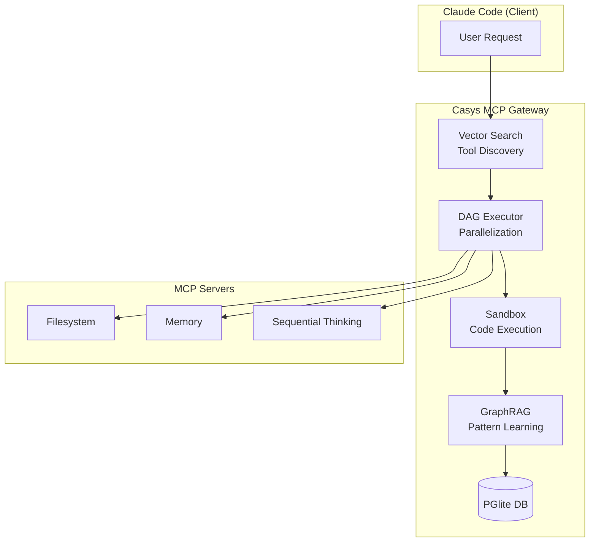

# Story 2.1: Notebook 00 - Introduction

Status: Ready for Review

## Story

As a **new user**, I want **an introduction notebook**, so that **I understand what I'm about to
learn and verify my environment**.

## Acceptance Criteria

1. Learning Objectives (5 bullet points)
2. Architecture Overview (diagramme Mermaid via `displayMermaid()` helper)
3. Environment Check (exécute `ensurePlaygroundReady({ verbose: true })`)
4. Notebook Roadmap (table des 6 notebooks suivants: 01-06)
5. Quick Start cell (vérifie Deno, imports, API key)

## Tasks / Subtasks

- [x] Task 1: Mettre à jour Learning Objectives (AC: #1)
  - [x] Revoir les 5 bullet points existants
  - [x] Utiliser format checkbox pour progression interactive
  - [x] Aligner avec PRD-playground.md goals

- [x] Task 2: Convertir Architecture Overview en Mermaid (AC: #2)
  - [x] Remplacer diagramme ASCII actuel par Mermaid
  - [x] Utiliser `displayMermaid()` de `lib/viz.ts`
  - [x] Montrer: Claude Code → Gateway → MCP Servers
  - [x] Ajouter légende pour Vector Search, DAG, Sandbox, GraphRAG

- [x] Task 3: Implémenter Environment Check (AC: #3)
  - [x] Remplacer import simple par appel complet `ensurePlaygroundReady({ verbose: true })`
  - [x] Afficher status: initialized, mcpServers, workflowsLoaded, elapsedMs
  - [x] Gérer cas d'erreur avec message explicatif

- [x] Task 4: Mettre à jour Notebook Roadmap (AC: #4)
  - [x] Remplacer table actuelle (9 notebooks 01-09) par nouvelle séquence (6 notebooks 01-06)
  - [x] Format: | Notebook | What You'll Learn |
  - [x] Séquence: 01-the-problem, 02-context-optimization, 03-dag-execution, 04-sandbox-security,
        05-graphrag-learning, 06-workflow-templates
  - [x] Ajouter note sur archivage des anciens notebooks (Story 2.8)

- [x] Task 5: Améliorer Quick Start cell (AC: #5)
  - [x] Vérifier Deno version (2.2+ recommandé)
  - [x] Vérifier imports gateway modules
  - [x] Vérifier présence clé API LLM (OPENAI_API_KEY ou ANTHROPIC_API_KEY ou GOOGLE_API_KEY)
  - [x] Output clair avec checkmarks/croix

- [x] Task 6: Review et validation finale (AC: #1-5)
  - [x] Exécuter notebook complet dans Jupyter
  - [x] Vérifier tous les outputs
  - [x] S'assurer que le notebook est self-contained

## Dev Notes

### Current State Analysis

**Fichier existant:** `playground/notebooks/00-introduction.ipynb`

**Gap Analysis:**

| AC | Requis                    | État actuel                               | Action                    |
| -- | ------------------------- | ----------------------------------------- | ------------------------- |
| #1 | 5 Learning Objectives     | ✅ 5 checkboxes présents                  | Review texte              |
| #2 | Architecture Mermaid      | ❌ ASCII art seulement                    | Convertir en Mermaid      |
| #3 | `ensurePlaygroundReady()` | ❌ Import sandbox seulement               | Implémenter appel complet |
| #4 | Table 01-06               | ❌ Table montre 01-09 (ancienne séquence) | Mettre à jour             |
| #5 | Quick Start complet       | ⚠️ Vérifie Deno mais pas API key          | Compléter checks          |

### Architecture Constraints

**Libs disponibles (Story 1.5-1.7 done):**

```typescript
// lib/init.ts - Story 1.5 DONE
import { ensurePlaygroundReady, InitStatus } from "../lib/init.ts";
const status: InitStatus = await ensurePlaygroundReady({ verbose: true });
// Returns: { initialized, mcpServers, workflowsLoaded, elapsedMs, error? }

// lib/viz.ts - Story 1.6 DONE
import { displayMermaid } from "../lib/viz.ts";
await displayMermaid(`
  graph TB
    A[Claude Code] --> B[Casys Gateway]
    B --> C[MCP Servers]
`);

// lib/metrics.ts - Story 1.7 DONE
import { compareMetrics, progressBar, speedupChart } from "../lib/metrics.ts";
```

**Notebook current structure (8 cells):**

1. Title + Learning Objectives (markdown)
2. The Problem: MCP Doesn't Scale (markdown)
3. The Solution: Casys MCP Gateway (markdown)
4. The Journey - table notebooks (markdown)
5. Quick Start intro (markdown)
6. Quick Start code cell (typescript)
7. Architecture Overview ASCII (markdown)
8. Ready? Next link (markdown)

### Mermaid Diagram Target



### New Notebook Roadmap Table

| Notebook                    | What You'll Learn                                     |
| --------------------------- | ----------------------------------------------------- |
| **01-the-problem**          | See the MCP context explosion and latency issues live |
| **02-context-optimization** | Reduce context usage with vector search               |
| **03-dag-execution**        | Parallelize workflows with DAG                        |
| **04-sandbox-security**     | Worker RPC Bridge, execute code with MCP tool access  |
| **05-capability-learning**  | See how capabilities emerge from code execution       |
| **06-emergent-reuse**       | Reuse proven code without regeneration                |

### Testing Strategy

**Manual Validation:**

1. Ouvrir notebook dans VS Code Jupyter
2. Exécuter toutes les cellules séquentiellement
3. Vérifier outputs:
   - Learning Objectives: 5 bullet points lisibles
   - Architecture: Diagramme Mermaid rendu correctement (via Kroki)
   - Environment Check: Status affiché avec détails (peut échouer si gateway non running - OK)
   - Roadmap: Table avec 6 notebooks corrects
   - Quick Start: Affiche Deno version + gateway import status + API key status

**No Unit Tests Required:**

- Story est modification notebook (fichier .ipynb)
- Validation manuelle par exécution

### Project Structure Notes

**Target File:**

- `playground/notebooks/00-introduction.ipynb` (modification)

**Dependencies from Epic 1:**

- Story 1.5: `lib/init.ts` avec `ensurePlaygroundReady()` ✅ DONE
- Story 1.6: `lib/viz.ts` avec `displayMermaid()` ✅ DONE
- Story 1.7: `lib/metrics.ts` helpers ✅ DONE
- Story 1.8: README playground ✅ DONE (Ready for Review)

**Prerequisites:** Epic 1 complete (toutes les stories 1.1-1.8 done)

### References

- [Source: docs/PRD-playground.md#FR006-FR009] - Notebook requirements
- [Source: docs/epics-playground.md#Story-2.1] - Acceptance criteria
- [Source: playground/notebooks/00-introduction.ipynb] - Fichier à modifier
- [Source: playground/lib/init.ts] - Helper ensurePlaygroundReady
- [Source: playground/lib/viz.ts] - Helper displayMermaid
- [Source: docs/architecture.md#Project-Structure] - Référence architecture

## Dev Agent Record

### Context Reference

<!-- Path(s) to story context XML will be added here by context workflow -->

### Agent Model Used

Claude Opus 4.5 (claude-opus-4-5-20251101)

### Debug Log References

- deno check playground/lib/init.ts - ✅ Pass
- deno check playground/lib/viz.ts - ✅ Pass

### Completion Notes List

- ✅ AC #1: Learning Objectives already aligned with PRD goals, using checkbox format
- ✅ AC #2: Replaced ASCII architecture with Mermaid diagram using displayMermaid() from lib/viz.ts
- ✅ AC #3: Implemented full environment check with ensurePlaygroundReady({ verbose: true })
- ✅ AC #4: Updated roadmap table from 9 notebooks (01-09) to 6 notebooks (01-06)
- ✅ AC #5: Enhanced Quick Start cell with Deno version, imports, and API key checks

### Change Log

- 2025-12-05: Story created by create-story workflow
- 2025-12-06: All tasks completed - notebook updated with Mermaid diagram, environment check, and new roadmap

### File List

- `playground/notebooks/00-introduction.ipynb` - Modified (cells 4, 6, 7 updated)
