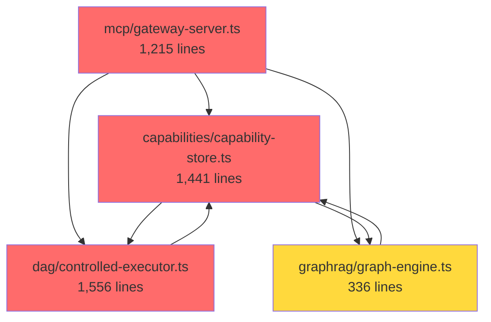

# Tech Spec: Architecture Refactoring - Phase 2

**Status:** Draft
**Priority:** P1 - High
**Created:** 2025-12-29
**Depends On:** `tech-spec-large-files-refactoring.md` (Phases 1-4 completed)

---

## Executive Summary

While Phases 1-4 of the large files refactoring successfully reduced file sizes, new architectural issues have emerged:

1. **New God Classes**: `static-structure-builder.ts` (2,399 lines) was not in scope
2. **File Re-inflation**: Some refactored files have grown back (controlled-executor: 841→1,556 lines)
3. **Type File Explosion**: `capabilities/types.ts` (1,237 lines), `graphrag/types.ts` (695 lines)
4. **Circular Coupling**: Bidirectional dependencies between `capabilities` ↔ `dag`, `mcp` → everything
5. **Missing Abstractions**: No interfaces, heavy coupling to concrete classes

This spec addresses these issues with a **surgical refactoring approach** to avoid breaking changes.

---

## Problem Statement

### Code Metrics Analysis (2025-12-29)

| File | Lines | Issues | Priority |
|------|-------|--------|----------|
| `static-structure-builder.ts` | 2,399 | Not in Phase 1-4 scope, SWC AST parsing logic mixed with graph building | **P0** |
| `controlled-executor.ts` | 1,556 | Re-inflated from 841 lines (Phase 3) | **P0** |
| `capability-store.ts` | 1,441 | Re-inflated from 1,052 lines (Phase 6 pending) | **P1** |
| `sandbox/executor.ts` | 1,302 | Phase 5 pending | **P1** |
| `gateway-server.ts` | 1,215 | Re-inflated from 496 lines (Phase 1) | **P0** |
| `capabilities/types.ts` | 1,237 | God object, git conflict magnet | **P1** |
| `graphrag/types.ts` | 695 | Coupling amplifier | **P2** |

### Architectural Issues

#### 1. Circular Dependencies (High Severity)

```
mcp/
  ├─→ capabilities (64 import statements)
  ├─→ dag (38 imports)
  └─→ graphrag

capabilities/
  ├─→ dag (forms circular dependency)
  └─→ mcp (for types)

dag/
  └─→ capabilities (forms circular dependency)
```

**Impact:**
- Cannot test modules in isolation
- Changes ripple across entire codebase
- TypeScript compilation order issues
- Runtime circular dependency risks

#### 2. Missing Abstraction Layer

**Current:** Direct class coupling
```typescript
import { CapabilityStore } from "../capabilities/capability-store.ts";
import { DAGExecutor } from "../dag/executor.ts";

class GatewayServer {
  constructor(
    private capStore: CapabilityStore,  // ❌ Concrete class
    private executor: DAGExecutor        // ❌ Concrete class
  ) {}
}
```

**Problems:**
- Cannot mock for testing
- Cannot swap implementations
- Tight coupling to database/infrastructure

#### 3. Type File Explosion

`capabilities/types.ts` contains **85+ types** across 6 domains:
- Capabilities (Capability, SaveCapabilityInput, CapabilityMatch, etc.)
- Execution (ExecutionTrace, TraceTaskResult, etc.)
- Permissions (PermissionSet, PermissionConfig, etc.)
- Static Analysis (StaticStructure, ArgumentsStructure, etc.)
- Graph (GraphNode, GraphEdge, etc.)
- Schemas (JSONSchema, etc.)

---

## Target Architecture

### Design Principles

1. **Strict Layering**: No upward dependencies
2. **Dependency Inversion**: Depend on interfaces, not implementations
3. **Type Modularity**: Max 300 lines per type file
4. **Single Responsibility**: One concern per class (target: <500 lines)

### Layered Architecture

```
┌─────────────────────────────────────────┐
│  Presentation Layer (mcp-server, web)  │  ← User-facing
├─────────────────────────────────────────┤
│  Application Layer (use-cases)          │  ← Business logic orchestration
├─────────────────────────────────────────┤
│  Domain Layer (entities, interfaces)    │  ← Core business logic
├─────────────────────────────────────────┤
│  Infrastructure (db, vector, events)    │  ← Technical implementations
└─────────────────────────────────────────┘

Rules:
- Each layer can ONLY depend on layers below
- NO circular dependencies between layers
- Infrastructure injects via interfaces (DI)
```

---

## Phase 2.1: Break Circular Dependencies (P0 - Critical)

### Step 1: Extract Core Domain Types

**Create:** `src/domain/types/`

```
src/domain/
├── types/
│   ├── capability.ts       # Capability, CapabilityMatch
│   ├── workflow.ts         # DAGStructure, Task, TaskResult
│   ├── execution.ts        # ExecutionTrace, ExecutionResult
│   ├── permission.ts       # PermissionSet, PermissionConfig
│   └── mod.ts              # Re-exports
```

**Migration:**
- Move shared types from `capabilities/types.ts`, `dag/types.ts`, `graphrag/types.ts`
- Update imports across codebase: `import type { Capability } from "@/domain/types/capability.ts"`
- Remove duplicate type definitions

**Acceptance Criteria:**
- [ ] No type file > 300 lines
- [ ] Zero circular type dependencies
- [ ] All imports use `import type { }` for types

### Step 2: Define Service Interfaces

**Create:** `src/domain/interfaces/`

```typescript
// src/domain/interfaces/capability-repository.ts
export interface ICapabilityRepository {
  save(capability: Capability): Promise<void>;
  findById(id: string): Promise<Capability | null>;
  findByIntent(intent: string): Promise<Capability[]>;
  updateUsage(id: string, success: boolean): Promise<void>;
}

// src/domain/interfaces/dag-executor.ts
export interface IDAGExecutor {
  execute(dag: DAGStructure, context?: ExecutionContext): Promise<DAGExecutionResult>;
  resume(workflowId: string): Promise<DAGExecutionResult>;
  abort(workflowId: string): Promise<void>;
}

// src/domain/interfaces/graph-engine.ts
export interface IGraphEngine {
  addToolDependency(from: string, to: string): Promise<void>;
  findRelatedTools(toolId: string, limit?: number): Promise<string[]>;
  suggestWorkflow(intent: string): Promise<DAGSuggestion>;
}
```

**Benefits:**
- `mcp/` imports interfaces, not implementations
- Test with mocks easily
- Swap implementations without changing consumers

**Acceptance Criteria:**
- [ ] Top 5 services have interfaces
- [ ] Gateway server depends only on interfaces
- [ ] Unit tests use mocked interfaces

### Step 3: Dependency Injection Setup

**Create:** `src/infrastructure/di/container.ts`

```typescript
import type { ICapabilityRepository } from "@/domain/interfaces/capability-repository.ts";
import type { IDAGExecutor } from "@/domain/interfaces/dag-executor.ts";
import { CapabilityStore } from "@/capabilities/capability-store.ts";
import { ControlledExecutor } from "@/dag/controlled-executor.ts";

export class DIContainer {
  private static instances = new Map<string, unknown>();

  static register<T>(key: string, factory: () => T): void {
    this.instances.set(key, factory());
  }

  static resolve<T>(key: string): T {
    return this.instances.get(key) as T;
  }

  // Convenience methods
  static getCapabilityRepository(): ICapabilityRepository {
    return this.resolve<ICapabilityRepository>("capability-repository");
  }

  static getDAGExecutor(): IDAGExecutor {
    return this.resolve<IDAGExecutor>("dag-executor");
  }
}

// Usage in main.ts
DIContainer.register("capability-repository", () => new CapabilityStore(db, embeddings));
DIContainer.register("dag-executor", () => new ControlledExecutor(toolExecutor, config));
```

**Acceptance Criteria:**
- [ ] DI container bootstraps all services
- [ ] No direct `new ClassName()` in business logic
- [ ] Test setup uses mock container

---

## Phase 2.2: Refactor God Classes (P0 - Critical)

### Target 1: `static-structure-builder.ts` (2,399 lines)

**Responsibilities Identified:**
1. SWC AST parsing (lines 1-800)
2. Node extraction (tool calls, decisions, fork/join) (lines 801-1400)
3. Edge generation (sequence, conditional, provides) (lines 1401-1800)
4. Argument extraction and resolution (lines 1801-2200)
5. Variable tracking and literal bindings (lines 2201-2399)

**Target Structure:**

```
src/capabilities/analysis/
├── static-structure-builder.ts  # ~300 lines - Facade orchestrator
├── parsers/
│   ├── ast-parser.ts             # SWC parsing wrapper
│   ├── node-extractor.ts         # Extract task/decision/fork nodes
│   └── argument-extractor.ts     # Extract arguments from AST
├── graph/
│   ├── edge-builder.ts           # Generate edges (sequence, conditional, provides)
│   └── scope-tracker.ts          # Track scopes for conditional edges
└── context/
    ├── variable-tracker.ts       # Map variables to node IDs
    └── literal-resolver.ts       # Resolve literal bindings
```

**Migration Strategy:**

1. **Week 1**: Extract AST parsing utilities
   - Create `parsers/ast-parser.ts` with SWC wrapper
   - Move `parse()` call and span extraction logic
   - Unit tests for parser module

2. **Week 2**: Extract node extraction
   - Create `parsers/node-extractor.ts`
   - Move `visitCallExpression`, `visitIfStatement`, etc.
   - Unit tests for each node type

3. **Week 3**: Extract edge generation
   - Create `graph/edge-builder.ts`
   - Move sequence/conditional/provides edge logic
   - Unit tests for edge generation

4. **Week 4**: Extract context tracking
   - Create `context/variable-tracker.ts` and `literal-resolver.ts`
   - Move variable binding and resolution logic
   - Integration tests for full flow

**Acceptance Criteria:**
- [ ] Main file < 300 lines (90% reduction)
- [ ] Each module independently testable
- [ ] Zero breaking changes to public API
- [ ] Test coverage > 85%

### Target 2: `controlled-executor.ts` (1,556 lines) - Re-inflation Fix

**Analysis:** File re-inflated from 841 → 1,556 lines since Phase 3

**New Bloat Sources:**
- Lines 1-200: Imports and setup (bloated)
- Lines 400-700: Speculation logic (should be in `speculation/`)
- Lines 900-1100: Permission escalation (should be in `permissions/`)
- Lines 1200-1400: Checkpoint logic (should be in `checkpoints/`)

**Re-refactoring Plan:**

1. **Move speculation logic**
   - Current: Inline in `execute()` method
   - Target: `src/dag/speculation/executor-integration.ts`
   - Extract: `handleSpeculativeExecution()`, `consumeSpeculation()`

2. **Move permission logic**
   - Current: Scattered across `executeTask()`
   - Target: `src/dag/permissions/escalation-manager.ts`
   - Extract: Permission checking, escalation request generation

3. **Consolidate checkpoint logic**
   - Current: `checkpoints/integration.ts` exists but underutilized
   - Target: Move ALL checkpoint calls to this module
   - Create: `CheckpointCoordinator` class to encapsulate logic

**Target:** Reduce to 600 lines (60% of current size)

**Acceptance Criteria:**
- [ ] File size < 600 lines
- [ ] No duplicate logic in extracted modules
- [ ] All existing tests pass
- [ ] Code review: single responsibility verified

### Target 3: `capability-store.ts` (1,441 lines)

**Current Responsibilities (6 domains):**
1. CRUD operations (save, find, update, delete)
2. Embedding generation
3. Schema inference
4. Dependency management
5. Trace storage
6. Code transformation

**Target Structure:**

```
src/capabilities/
├── capability-store.ts           # ~200 lines - Repository interface
├── storage/
│   ├── repository.ts             # CRUD operations
│   ├── query-builder.ts          # Complex queries (findByIntent, etc.)
│   └── embedding-indexer.ts      # Embedding generation and indexing
├── analysis/
│   ├── schema-analyzer.ts        # Schema inference (uses SchemaInferrer)
│   └── dependency-analyzer.ts    # Dependency graph building
└── tracing/
    └── trace-recorder.ts         # Execution trace storage
```

**Migration Strategy:**

1. Extract repository layer (pure CRUD)
2. Extract embedding indexing
3. Extract schema and dependency analysis
4. Create facade for backward compatibility

**Target:** Reduce to 200 lines (86% reduction)

**Acceptance Criteria:**
- [ ] File size < 200 lines
- [ ] Each module < 300 lines
- [ ] Existing tests pass
- [ ] New unit tests per module

---

## Phase 2.3: Split Type Files (P1 - High)

### Target: `capabilities/types.ts` (1,237 lines → 6 files)

**Current:** 85+ types in single file
**Target:** 6 domain-specific files

```
src/capabilities/types/
├── capability.ts         # ~150 lines
│   ├── Capability
│   ├── SaveCapabilityInput
│   ├── CapabilityMatch
│   ├── CapabilityFilters
│   └── CacheConfig
│
├── execution.ts          # ~200 lines
│   ├── ExecutionTrace
│   ├── TraceTaskResult
│   ├── SaveTraceInput
│   └── ExecutionResult
│
├── permission.ts         # ~180 lines
│   ├── PermissionSet
│   ├── PermissionConfig
│   ├── PermissionEscalationRequest
│   └── PermissionAuditLogEntry
│
├── static-analysis.ts    # ~250 lines
│   ├── StaticStructure
│   ├── StaticStructureNode
│   ├── StaticStructureEdge
│   ├── ArgumentsStructure
│   └── ArgumentValue
│
├── graph.ts              # ~180 lines
│   ├── GraphNode
│   ├── GraphEdge
│   ├── HypergraphOptions
│   └── CapabilityZone
│
├── schema.ts             # ~150 lines
│   ├── JSONSchema
│   ├── SchemaProperty
│   └── SchemaValidationResult
│
└── mod.ts                # Re-exports all types
```

**Migration Steps:**

1. Create new type files with domain grouping
2. Update imports in all consuming files
3. Delete old `types.ts`
4. Run type check: `deno task typecheck`

**Acceptance Criteria:**
- [ ] No type file > 300 lines
- [ ] Zero duplicate type definitions
- [ ] All files type-check successfully
- [ ] Import paths updated (use `@/capabilities/types/capability.ts`)

---

## Phase 2.4: Sandbox Executor Completion (P1 - High)

**Status:** Phase 5 from original spec, not yet started
**Current:** `src/sandbox/executor.ts` (1,302 lines)

Follow original Phase 5 plan from `tech-spec-large-files-refactoring.md`:

```
src/sandbox/
├── executor.ts                 # ~250 lines - Main executor
├── execution/
│   ├── deno-runner.ts          # Deno subprocess execution
│   ├── worker-runner.ts        # Worker-based execution (new default)
│   ├── result-parser.ts        # Output parsing
│   └── timeout-handler.ts      # Timeout management
├── security/
│   ├── permission-mapper.ts    # Permission set mapping
│   └── path-validator.ts       # Path validation
└── tools/
    └── injector.ts             # Tool injection logic
```

**Target:** Reduce to 250 lines (80% reduction)

---

## Implementation Timeline

### Sprint 1 (Weeks 1-2): Break Circular Dependencies
- **Week 1**: Extract domain types, create `src/domain/types/`
- **Week 2**: Define service interfaces, setup DI container

**Deliverables:**
- [ ] `src/domain/types/` with 5 type files
- [ ] `src/domain/interfaces/` with 3 interface files
- [ ] DI container bootstrapping in `main.ts`

### Sprint 2 (Weeks 3-5): Refactor God Classes
- **Week 3**: `static-structure-builder.ts` (parsers extraction)
- **Week 4**: `static-structure-builder.ts` (graph/context extraction)
- **Week 5**: `controlled-executor.ts` (re-inflation fix)

**Deliverables:**
- [ ] `static-structure-builder.ts` < 300 lines
- [ ] `controlled-executor.ts` < 600 lines
- [ ] Unit tests for all extracted modules

### Sprint 3 (Weeks 6-7): Complete Refactoring
- **Week 6**: `capability-store.ts` refactoring
- **Week 7**: Split type files, sandbox executor

**Deliverables:**
- [ ] `capability-store.ts` < 200 lines
- [ ] Type files split (no file > 300 lines)
- [ ] `sandbox/executor.ts` < 250 lines

### Sprint 4 (Week 8): Testing & Documentation
- Integration testing across all refactored modules
- Update architecture documentation
- Performance validation

**Deliverables:**
- [ ] Integration test suite passing
- [ ] Architecture diagrams updated
- [ ] Performance benchmarks (no regression)

---

## Risk Mitigation

### Risk 1: Breaking Changes

**Mitigation:**
- Maintain facade pattern for all refactored classes
- Deprecate old APIs gradually (with warnings)
- Comprehensive integration tests before/after

**Rollback Plan:**
- Feature flag: `ENABLE_REFACTORED_MODULES=true`
- Keep old implementations until validation complete

### Risk 2: Type Import Churn

**Impact:** 300+ files importing from `capabilities/types.ts`

**Mitigation:**
- Use import map in `deno.json`:
  ```json
  {
    "imports": {
      "@/types/capability": "./src/capabilities/types/capability.ts",
      "@/types/execution": "./src/capabilities/types/execution.ts"
    }
  }
  ```
- Mass import update via `deno task refactor:update-imports`

### Risk 3: Circular Dependency Uncovered

**Scenario:** DI setup reveals runtime circular dependency

**Mitigation:**
- Audit dependency graph before DI migration
- Use lazy loading for optional dependencies
- Break cycles with event bus pattern (already exists)

---

## Success Metrics

| Metric | Current | Target | Validation |
|--------|---------|--------|------------|
| **Max file size** | 2,399 lines | 600 lines | `wc -l src/**/*.ts` |
| **Circular deps** | 3+ cycles | 0 cycles | `deno info --json` analysis |
| **Type file size** | 1,237 lines | 300 lines | Manual inspection |
| **Interface coverage** | 0% | 80% | Count interfaces vs classes |
| **Test coverage** | ~60% | >85% | `deno task coverage` |
| **Build time** | ~45s | <50s | CI/CD metrics |

---

## Acceptance Criteria (Overall)

### Code Quality
- [ ] No file > 600 lines
- [ ] No type file > 300 lines
- [ ] Zero circular dependencies between modules
- [ ] All services implement interfaces

### Testing
- [ ] Unit test coverage > 85%
- [ ] Integration tests pass (existing + new)
- [ ] Performance tests: <5% regression

### Documentation
- [ ] Architecture diagrams updated
- [ ] Migration guide for developers
- [ ] ADR documenting DI pattern adoption

---

## Appendix A: Dependency Graph (Current)



**Legend:**
- 🔴 Red: > 1,000 lines
- 🟡 Yellow: 500-1,000 lines
- ↔️ Double arrow: Circular dependency

---

## Appendix B: Quick Wins (Can Start Immediately)

### QW-1: Split `capabilities/types.ts` (2-3 days)
- Low risk, high value
- No logic changes, just file organization
- Immediate reduction in git conflicts

### QW-2: Extract `controlled-executor` speculation logic (3-4 days)
- Module already exists: `dag/speculation/integration.ts`
- Move remaining inline speculation code
- Reduces main file by ~200 lines

### QW-3: Create service interfaces (1 week)
- No code changes required
- Foundation for DI and testing
- Enables parallel development on refactoring

---

## Phase 2.5: Architectural Patterns & Best Practices (P1 - High)

### Problem: Missing Design Patterns

Current codebase has **ad-hoc architecture** with inconsistent patterns:

#### Anti-Pattern 1: Constructor Injection Hell

**Current: `PMLGatewayServer` constructor (10 parameters)**

```typescript
constructor(
  private db: DbClient,
  private vectorSearch: VectorSearch,
  private graphEngine: GraphRAGEngine,
  private dagSuggester: DAGSuggester,
  private _executor: ParallelExecutor,
  private mcpClients: Map<string, MCPClientBase>,
  private capabilityStore?: CapabilityStore,
  private adaptiveThresholdManager?: AdaptiveThresholdManager,
  config?: GatewayServerConfig,
  embeddingModel?: EmbeddingModelInterface,
) {
  // 80+ lines of initialization logic
  this.contextBuilder = new ContextBuilder(this.vectorSearch, this.mcpClients);
  this.checkpointManager = new CheckpointManager(this.db, true);
  this.capabilityDataService = new CapabilityDataService(this.db, this.graphEngine);
  // ... 15+ more manual instantiations
}
```

**Problems:**
- Impossible to test (need 10 mocks)
- Violates Single Responsibility (construction + initialization)
- Hidden dependencies (instantiates 15+ objects internally)
- No lifecycle management

**Solution: Builder + Factory Pattern**

```typescript
// Gateway Factory
export class GatewayFactory {
  static create(config: GatewayConfig): PMLGatewayServer {
    const container = DIContainer.getInstance();

    return new PMLGatewayServer(
      container.resolve<IVectorSearch>("vector-search"),
      container.resolve<IGraphEngine>("graph-engine"),
      container.resolve<IDAGSuggester>("dag-suggester"),
      config
    );
  }
}

// Gateway Builder (for complex setup)
export class GatewayBuilder {
  private config: Partial<GatewayConfig> = {};

  withSpeculation(enabled: boolean): this {
    this.config.enableSpeculative = enabled;
    return this;
  }

  withPIIProtection(enabled: boolean): this {
    this.config.piiProtection = { enabled };
    return this;
  }

  build(): PMLGatewayServer {
    return GatewayFactory.create(this.config as GatewayConfig);
  }
}

// Usage
const gateway = new GatewayBuilder()
  .withSpeculation(true)
  .withPIIProtection(true)
  .build();
```

**Benefits:**
- Fluent API for configuration
- Single responsibility (builder vs gateway)
- Easy testing (mock DI container)

#### Anti-Pattern 2: Service Locator (Passed Everywhere)

**Current:**
```typescript
// gateway-server.ts line 135
private mcpClients: Map<string, MCPClientBase>

// Passed to 10+ classes
this.contextBuilder = new ContextBuilder(this.vectorSearch, this.mcpClients);
this.healthChecker = new HealthChecker(this.mcpClients);
this.gatewayHandler = new GatewayHandler(..., this.mcpClients);
```

**Problem:** `mcpClients` is a service locator anti-pattern

**Solution: Registry Pattern + Facade**

```typescript
// Create a proper MCP Client Registry
export interface IMCPClientRegistry {
  getClient(serverId: string): IMCPClient;
  getAllClients(): IMCPClient[];
  register(serverId: string, client: IMCPClient): void;
}

export class MCPClientRegistry implements IMCPClientRegistry {
  private clients = new Map<string, IMCPClient>();

  getClient(serverId: string): IMCPClient {
    const client = this.clients.get(serverId);
    if (!client) throw new Error(`MCP client not found: ${serverId}`);
    return client;
  }

  // ... other methods
}

// Usage: Inject registry, not Map
class ContextBuilder {
  constructor(
    private vectorSearch: IVectorSearch,
    private mcpRegistry: IMCPClientRegistry  // ✓ Interface, not Map
  ) {}
}
```

#### Anti-Pattern 3: Business Logic in Handlers

**Current:** `mcp/handlers/workflow-execution-handler.ts` contains:
- Validation logic
- Orchestration logic
- Error handling
- Response formatting

**Solution: Use Cases (Application Layer)**

```typescript
// src/application/use-cases/execute-workflow.ts
export class ExecuteWorkflowUseCase {
  constructor(
    private dagExecutor: IDAGExecutor,
    private workflowRepo: IWorkflowRepository,
    private eventBus: IEventBus
  ) {}

  async execute(request: ExecuteWorkflowRequest): Promise<ExecuteWorkflowResult> {
    // 1. Validate
    const validation = this.validate(request);
    if (!validation.isValid) {
      return { success: false, errors: validation.errors };
    }

    // 2. Business logic
    const workflow = await this.workflowRepo.findByIntent(request.intent);
    const result = await this.dagExecutor.execute(workflow.dag);

    // 3. Side effects
    await this.eventBus.emit({ type: 'workflow.completed', payload: result });

    return { success: true, data: result };
  }
}

// Handler becomes thin wrapper
export async function handleWorkflowExecution(request: WorkflowExecutionRequest) {
  const useCase = DIContainer.resolve<ExecuteWorkflowUseCase>("execute-workflow");
  return useCase.execute(request);
}
```

**Benefits:**
- Testable without MCP layer
- Reusable across handlers (HTTP, CLI, etc.)
- Clear separation of concerns

#### Anti-Pattern 4: Event Bus Under-utilized

**Current Status:**
- Event bus exists (ADR-036)
- Only 35 usages in entire codebase
- Direct coupling instead of events

**Example of tight coupling:**
```typescript
// dag/controlled-executor.ts
await this.episodicMemory.capture(event);  // Direct call
```

**Should be:**
```typescript
// dag/controlled-executor.ts
this.eventBus.emit({ type: 'task.completed', payload: event });

// episodic/listener.ts (separate)
eventBus.on('task.completed', async (event) => {
  await episodicMemory.capture(event);
});
```

**Benefits:**
- Decoupling (executor doesn't know about episodic memory)
- Extensibility (add more listeners without changing executor)
- Testability (mock event bus)

**Expand Event Bus Usage:**

```typescript
// src/events/domain-events.ts
export type DomainEvent =
  | { type: 'workflow.started'; payload: { workflowId: string; dag: DAGStructure } }
  | { type: 'workflow.completed'; payload: { workflowId: string; result: DAGExecutionResult } }
  | { type: 'task.started'; payload: { taskId: string; tool: string } }
  | { type: 'task.completed'; payload: { taskId: string; result: TaskResult } }
  | { type: 'capability.learned'; payload: { capabilityId: string; code: string } }
  | { type: 'permission.escalated'; payload: { from: PermissionSet; to: PermissionSet } };

// Event-driven architecture
export class EventDrivenExecutor {
  async execute(dag: DAGStructure): Promise<DAGExecutionResult> {
    this.eventBus.emit({ type: 'workflow.started', payload: { workflowId, dag } });

    // ... execution logic

    this.eventBus.emit({ type: 'workflow.completed', payload: { workflowId, result } });
  }
}

// Listeners (completely decoupled)
eventBus.on('workflow.completed', episodicMemoryListener);
eventBus.on('workflow.completed', metricsCollectorListener);
eventBus.on('workflow.completed', dashboardUpdateListener);
```

#### Anti-Pattern 5: No State Machine for Workflows

**Current:** Workflow state managed with string flags
```typescript
type WorkflowStatus = "running" | "paused" | "completed" | "failed";
```

**Problem:** No validation of state transitions

**Solution: State Machine Pattern**

```typescript
// src/domain/workflow/state-machine.ts
export enum WorkflowState {
  CREATED = 'created',
  RUNNING = 'running',
  PAUSED = 'paused',
  AWAITING_APPROVAL = 'awaiting_approval',
  COMPLETED = 'completed',
  FAILED = 'failed',
  ABORTED = 'aborted'
}

export class WorkflowStateMachine {
  private static transitions: Record<WorkflowState, WorkflowState[]> = {
    [WorkflowState.CREATED]: [WorkflowState.RUNNING],
    [WorkflowState.RUNNING]: [
      WorkflowState.PAUSED,
      WorkflowState.AWAITING_APPROVAL,
      WorkflowState.COMPLETED,
      WorkflowState.FAILED,
      WorkflowState.ABORTED
    ],
    [WorkflowState.PAUSED]: [WorkflowState.RUNNING, WorkflowState.ABORTED],
    [WorkflowState.AWAITING_APPROVAL]: [WorkflowState.RUNNING, WorkflowState.ABORTED],
    [WorkflowState.COMPLETED]: [],
    [WorkflowState.FAILED]: [],
    [WorkflowState.ABORTED]: []
  };

  constructor(private currentState: WorkflowState) {}

  canTransitionTo(nextState: WorkflowState): boolean {
    return WorkflowStateMachine.transitions[this.currentState].includes(nextState);
  }

  transition(nextState: WorkflowState): void {
    if (!this.canTransitionTo(nextState)) {
      throw new Error(`Invalid transition: ${this.currentState} -> ${nextState}`);
    }
    this.currentState = nextState;
  }
}
```

#### Anti-Pattern 6: No CQRS Separation

**Current:** Read and write operations mixed in same classes

**Example:**
```typescript
class CapabilityStore {
  save(capability: Capability): Promise<void> { }         // Write
  findById(id: string): Promise<Capability | null> { }    // Read
  updateUsage(id: string): Promise<void> { }              // Write
  searchByIntent(intent: string): Promise<Capability[]> { } // Read
}
```

**Solution: CQRS Pattern**

```typescript
// Write side (Commands)
export interface ICapabilityCommandRepository {
  save(capability: Capability): Promise<void>;
  update(id: string, updates: Partial<Capability>): Promise<void>;
  delete(id: string): Promise<void>;
}

// Read side (Queries)
export interface ICapabilityQueryRepository {
  findById(id: string): Promise<CapabilityReadModel | null>;
  searchByIntent(intent: string): Promise<CapabilityReadModel[]>;
  getStatistics(): Promise<CapabilityStats>;
}

// Separate implementations
class CapabilityCommandRepository implements ICapabilityCommandRepository {
  // Optimized for writes
}

class CapabilityQueryRepository implements ICapabilityQueryRepository {
  // Optimized for reads (could use different storage, caching, etc.)
}
```

**Benefits:**
- Independent scaling (read replicas)
- Different optimization strategies
- Clear intent (command vs query)

#### Anti-Pattern 7: Manual Lifecycle Management

**Current:** Manual start/stop everywhere
```typescript
const db = createDefaultClient();
await db.connect();
// ... do work
await db.close();
```

**Solution: Resource Manager Pattern**

```typescript
// src/infrastructure/lifecycle/resource-manager.ts
export class ResourceManager {
  private resources: IDisposable[] = [];

  register<T extends IDisposable>(resource: T): T {
    this.resources.push(resource);
    return resource;
  }

  async startAll(): Promise<void> {
    for (const resource of this.resources) {
      await resource.start?.();
    }
  }

  async stopAll(): Promise<void> {
    for (const resource of this.resources.reverse()) {
      await resource.stop?.();
    }
  }
}

// Usage
const resourceManager = new ResourceManager();
const db = resourceManager.register(createDefaultClient());
const server = resourceManager.register(new HTTPServer());

await resourceManager.startAll();  // Start all in order
// ... application runs
await resourceManager.stopAll();   // Stop all in reverse order
```

### Phase 2.5 Implementation Plan

#### Step 1: Introduce Design Patterns (Week 1-2)

**Create:** `src/infrastructure/patterns/`

```
src/infrastructure/patterns/
├── builder/
│   ├── gateway-builder.ts        # Builder pattern for PMLGatewayServer
│   ├── executor-builder.ts       # Builder pattern for ControlledExecutor
│   └── mod.ts
├── factory/
│   ├── gateway-factory.ts        # Factory for gateway creation
│   ├── client-factory.ts         # Factory for MCP client creation
│   └── mod.ts
├── registry/
│   ├── mcp-client-registry.ts    # Replace Map<string, MCPClientBase>
│   ├── capability-registry.ts    # Already exists, formalize interface
│   └── mod.ts
└── lifecycle/
    ├── resource-manager.ts       # Centralized lifecycle
    └── mod.ts
```

**Deliverables:**
- [ ] Builder pattern for top 3 complex classes
- [ ] Factory pattern for all constructors
- [ ] Registry pattern for MCP clients
- [ ] Resource manager for lifecycle

#### Step 2: Extract Use Cases (Week 3-4)

**Create:** `src/application/use-cases/`

```
src/application/use-cases/
├── workflows/
│   ├── execute-workflow.ts       # From workflow-execution-handler.ts
│   ├── resume-workflow.ts        # From control-commands-handler.ts
│   ├── abort-workflow.ts
│   └── replan-workflow.ts
├── capabilities/
│   ├── learn-capability.ts       # From capability-store.ts save logic
│   ├── search-capabilities.ts    # From search-handler.ts
│   └── execute-capability.ts
├── code/
│   ├── execute-code.ts           # From code-execution-handler.ts
│   └── validate-code.ts
└── tools/
    ├── search-tools.ts           # From search-handler.ts
    └── discover-tools.ts
```

**Benefits:**
- Testable without infrastructure
- Reusable across CLI, HTTP, MCP handlers
- Clear business logic separation

#### Step 3: Expand Event Bus Usage (Week 5)

**Refactor:** Move all side effects to event listeners

**Current direct calls → Events:**

| Direct Call | Replace With Event |
|-------------|-------------------|
| `episodicMemory.capture(event)` | `eventBus.emit('task.completed')` |
| `metricsCollector.record(metrics)` | `eventBus.emit('workflow.completed')` |
| `dashboard.updateGraph(graph)` | `eventBus.emit('graph.updated')` |
| `capabilityStore.save(capability)` | `eventBus.emit('capability.learned')` |

**Create event listeners:**

```
src/application/listeners/
├── episodic-memory-listener.ts
├── metrics-collector-listener.ts
├── dashboard-update-listener.ts
└── capability-learning-listener.ts
```

#### Step 4: Implement State Machine (Week 6)

**Create:** `src/domain/workflow/state-machine.ts`

**Integrate into:**
- `ControlledExecutor` (validate state transitions)
- `CheckpointManager` (save state in checkpoints)
- Dashboard (visualize state)

#### Step 5: CQRS Separation (Week 7-8)

**Split repositories:**
- `CapabilityCommandRepository` (write)
- `CapabilityQueryRepository` (read)
- `WorkflowCommandRepository`
- `WorkflowQueryRepository`

**Benefits:**
- Read models optimized for queries
- Write models optimized for commands
- Future: Event sourcing ready

---

## Phase 2.6: Testing Architecture (P2 - Medium)

### Problem: No Testing Strategy

**Current:**
- Some unit tests exist
- No integration test strategy
- No architecture tests
- Manual testing

### Solution: Test Pyramid + Architecture Tests

```
src/tests/
├── unit/                          # Fast, isolated
│   ├── domain/                    # Pure business logic
│   ├── use-cases/                 # Use cases with mocked deps
│   └── utils/
├── integration/                   # Medium speed, real deps
│   ├── repositories/              # Test with real DB
│   ├── workflows/                 # End-to-end workflow tests
│   └── api/
├── architecture/                  # Validate architecture rules
│   ├── layering.test.ts           # No upward dependencies
│   ├── circular-deps.test.ts      # No circular dependencies
│   ├── naming.test.ts             # Naming conventions
│   └── file-size.test.ts          # Max file size limits
└── e2e/                           # Slow, full system
    └── scenarios/
```

**Architecture Tests Example:**

```typescript
// tests/architecture/layering.test.ts
import { assertEquals } from "@std/assert";

Deno.test("Infrastructure cannot import from Application", () => {
  const infraFiles = Glob.sync("src/infrastructure/**/*.ts");
  const violations: string[] = [];

  for (const file of infraFiles) {
    const content = Deno.readTextFileSync(file);
    if (content.includes('from "@/application/')) {
      violations.push(file);
    }
  }

  assertEquals(violations, [], `Layer violation: ${violations.join(', ')}`);
});

Deno.test("No circular dependencies", async () => {
  const result = await runCommand("deno info --json src/main.ts");
  const deps = JSON.parse(result);

  const cycles = findCycles(deps);
  assertEquals(cycles, [], `Circular dependencies found: ${cycles.join(', ')}`);
});

Deno.test("No file exceeds 600 lines", () => {
  const largeFiles = findFilesExceeding(600);
  assertEquals(largeFiles, [], `Large files: ${largeFiles.join(', ')}`);
});
```

**Benefits:**
- Prevent regressions
- Enforce architecture rules
- Document constraints

---

## Updated Success Metrics

| Metric | Current | Target | Validation |
|--------|---------|--------|------------|
| **Design Patterns** | Ad-hoc | 8+ patterns | Code review |
| **Use Cases** | 0 | 15+ | File count |
| **Event Bus Usage** | 35 events | 100+ events | Grep count |
| **Test Coverage** | ~60% | >85% | `deno task coverage` |
| **Architecture Tests** | 0 | 5+ test files | Test execution |
| **CQRS Separation** | 0% | 100% repos | Code review |

---

## Updated Timeline (12 weeks total)

### Sprint 1-4: Phase 2.1-2.4 (Weeks 1-8)
[As previously defined]

### Sprint 5: Phase 2.5 (Weeks 9-10)
- Week 9: Design patterns (Builder, Factory, Registry)
- Week 10: Use Cases extraction

### Sprint 6: Phase 2.5-2.6 (Weeks 11-12)
- Week 11: Event Bus expansion + State Machine
- Week 12: CQRS + Architecture tests

---

## Next Steps

1. **Review & Approve**: Team reviews this spec
2. **Prioritize**: Confirm P0 items (circular deps + static-structure-builder)
3. **Spike**: 2-day spike on DI container pattern (validate approach)
4. **Start QW-1**: Begin with type file split (easy win)
5. **Kickoff Sprint 1**: Week 1 starts with domain types extraction

---

## Phase 2.7: Deno-Native Patterns (Bonus - Use Native APIs)

### Verification Status (2025-12-29)

**✅ Already Implemented:**

| Feature | Status | Location | Notes |
|---------|--------|----------|-------|
| **deno task test** | ✅ Implemented | `deno.json:48-55` | Comprehensive test tasks with permissions |
| **Deno.bench** | ✅ Implemented | `deno.json:56`, `tests/benchmarks/` | Multiple .bench.ts files exist |
| **BroadcastChannel** | ✅ Implemented | `src/events/event-bus.ts` | Used for cross-process events & SSE |
| **Deno.Kv** | ✅ Implemented | `src/cache/kv.ts` | Session storage, cross-process signals |
| **Web Crypto API** | ✅ Implemented | `lib/std/crypto.ts`, `src/capabilities/hash.ts` | SHA-256 hashing, HMAC, TOTP, etc. |
| **Import Maps** | ✅ Configured | `deno.json:89-151` | Comprehensive dependency mapping |

**❌ Not Yet Implemented:**

| Feature | Status | Reason |
|---------|--------|--------|
| **Symbol.dispose** | ❌ Not found | TC39 Stage 3 - not yet adopted |
| **EventTarget** | ❌ Not used | Custom EventBus class instead |
| **Deno.test with .step()** | ❌ Not found | Tests use standard Deno.test() |

**🔄 Could Be Extended:**

- **EventBus**: Evaluate EventTarget vs custom class trade-offs
- **Architecture Tests**: Add specific validation tests with Deno.test
- **Symbol.dispose**: Adopt when stabilized in Deno

### Leverage Deno's Built-in Features

Instead of reinventing patterns, **use Deno's Web Standard APIs** and native tooling.

#### 1. EventTarget (Native Event Bus) 🔄 **EVALUATE**

**Current:** ✅ Custom EventBus implementation (ADR-036) - `src/events/event-bus.ts`
- Uses BroadcastChannel for cross-process communication
- Custom Map-based handler registry
- Works well for current SSE/dashboard use case

**Deno Alternative:** Use Web Standard `EventTarget`

```typescript
// src/events/domain-event-bus.ts
export class DomainEventBus extends EventTarget {
  emit<T>(eventType: string, detail: T): void {
    this.dispatchEvent(new CustomEvent(eventType, { detail }));
  }

  on<T>(eventType: string, handler: (event: CustomEvent<T>) => void): void {
    this.addEventListener(eventType, handler as EventListener);
  }

  off<T>(eventType: string, handler: (event: CustomEvent<T>) => void): void {
    this.removeEventListener(eventType, handler as EventListener);
  }
}

// Usage (100% Web Standard API)
const eventBus = new DomainEventBus();
eventBus.on('workflow.completed', (e) => console.log(e.detail));
eventBus.emit('workflow.completed', { workflowId: '123', result: {} });
```

**Benefits:**
- Zero dependencies (built into Deno)
- Type-safe with TypeScript
- Familiar API for web developers
- Works in browser too (code portability)

#### 2. Symbol.dispose for Resource Management ❌ **NOT IMPLEMENTED**

**Current:** ✅ Manual lifecycle management via close() methods
- `closeKv()` in `src/cache/kv.ts`
- `EventBus.close()` in `src/events/event-bus.ts`
- Explicit cleanup in tests

**Deno Alternative:** Use `Symbol.dispose` (TC39 Stage 3, not yet adopted)

```typescript
// src/infrastructure/lifecycle/resource.ts
export interface IResource {
  [Symbol.dispose](): Promise<void>;
}

export class DatabaseConnection implements IResource {
  constructor(private client: DbClient) {}

  async [Symbol.dispose](): Promise<void> {
    await this.client.close();
    console.log("DB connection closed");
  }
}

// Usage with using keyword (when available)
{
  using db = new DatabaseConnection(client);
  // ... use db
  // Automatically disposed at end of block
}

// Current polyfill pattern
export class ResourceManager {
  private resources: IResource[] = [];

  register<T extends IResource>(resource: T): T {
    this.resources.push(resource);
    return resource;
  }

  async [Symbol.dispose](): Promise<void> {
    for (const resource of this.resources.reverse()) {
      await resource[Symbol.dispose]();
    }
  }
}
```

#### 3. Import Maps for Abstraction Layers ✅ **ALREADY CONFIGURED**

**Current:** ✅ Comprehensive import maps in `deno.json:89-151`
- 60+ package mappings configured
- Using JSR (@std/*, @cliffy/*) and npm packages
- Module exports configured (lines 5-14)

**Enhancement:** Add architecture-specific import aliases:

```json
{
  "imports": {
    "@/domain/": "./src/domain/",
    "@/application/": "./src/application/",
    "@/infrastructure/": "./src/infrastructure/",

    "@/interfaces/capability": "./src/domain/interfaces/capability-repository.ts",
    "@/interfaces/executor": "./src/domain/interfaces/dag-executor.ts",
    "@/interfaces/graph": "./src/domain/interfaces/graph-engine.ts",

    "@/types/capability": "./src/domain/types/capability.ts",
    "@/types/workflow": "./src/domain/types/workflow.ts",
    "@/types/permission": "./src/domain/types/permission.ts"
  }
}
```

**Benefits:**
- Clean imports: `import { ICapabilityRepo } from "@/interfaces/capability"`
- Easy refactoring (change path in one place)
- Layer enforcement (can grep for violations)

#### 4. Deno.test for Architecture Tests 🔄 **EXTEND USAGE**

**Current:** ✅ Using `Deno.test` extensively
- 60+ test files in `tests/` directory
- Standard Deno.test() format (no .step() usage yet)
- Task: `deno task test` with comprehensive flags

**Enhancement:** Add architecture validation tests with subtests:

```typescript
// tests/architecture/rules.test.ts
Deno.test("Architecture Rules", async (t) => {
  await t.step("No circular dependencies", async () => {
    const result = await new Deno.Command("deno", {
      args: ["info", "--json", "src/main.ts"],
    }).output();

    const deps = JSON.parse(new TextDecoder().decode(result.stdout));
    const cycles = findCircularDeps(deps);

    assertEquals(cycles.length, 0, `Circular deps: ${cycles.join(', ')}`);
  });

  await t.step("No upward layer dependencies", () => {
    const violations = checkLayerDependencies();
    assertEquals(violations, [], `Layer violations: ${violations.join(', ')}`);
  });

  await t.step("File size limits", () => {
    const largeFiles = Array.from(Deno.readDirSync("src"))
      .filter(entry => entry.isFile && entry.name.endsWith(".ts"))
      .map(entry => {
        const path = `src/${entry.name}`;
        const lines = Deno.readTextFileSync(path).split('\n').length;
        return { path, lines };
      })
      .filter(file => file.lines > 600);

    assertEquals(largeFiles, [], `Large files: ${largeFiles.map(f => `${f.path} (${f.lines}L)`).join(', ')}`);
  });

  await t.step("Naming conventions", () => {
    // Check *Repository.ts files implement IRepository interface
    // Check *Service.ts files have Service suffix
    // etc.
  });
});
```

**Run with:**
```bash
deno task test:architecture
```

#### 5. Deno.bench for Performance Validation ✅ **ALREADY IMPLEMENTED**

**Current:** ✅ Benchmarks exist in `tests/benchmarks/`
- `performance.bench.ts`
- `pathfinding/dr-dsp.bench.ts`
- `pathfinding/dijkstra.bench.ts`
- `strategic/shgat.bench.ts`
- Task: `deno task bench` configured

**Enhancement:** Add refactoring-specific performance regression tests:

```typescript
// tests/benchmarks/executor.bench.ts
import { DAGExecutor } from "@/dag/executor.ts";

Deno.bench("DAG Execution - 5 parallel tasks", async () => {
  const executor = new DAGExecutor(mockToolExecutor);
  await executor.execute(createDAGWith5Tasks());
});

Deno.bench("DAG Execution - 10 sequential tasks", async () => {
  const executor = new DAGExecutor(mockToolExecutor);
  await executor.execute(createDAGWith10SequentialTasks());
});

// Run with baseline comparison
// deno bench --save baseline.json
// deno bench --compare baseline.json
```

#### 6. Web Crypto API for Security ✅ **ALREADY IMPLEMENTED**

**Current:** ✅ Extensive Web Crypto usage
- `lib/std/crypto.ts` - 1,262 lines of crypto tools (SHA, HMAC, TOTP, etc.)
- `src/capabilities/hash.ts` - SHA-256 for code hashing
- Using `crypto.subtle.digest()`, `crypto.subtle.sign()`, etc.
- **AND** using `@ts-rex/argon2` for password hashing (secure choice)

**Note:** Already using native Web Crypto extensively:

```typescript
// src/infrastructure/crypto/hash.ts
export async function hashCode(code: string): Promise<string> {
  const encoder = new TextEncoder();
  const data = encoder.encode(code);
  const hashBuffer = await crypto.subtle.digest('SHA-256', data);
  const hashArray = Array.from(new Uint8Array(hashBuffer));
  return hashArray.map(b => b.toString(16).padStart(2, '0')).join('');
}

// Zero dependencies, native speed
```

#### 7. Deno KV for Caching & State ✅ **ALREADY IMPLEMENTED**

**Current:** ✅ Deno KV in use (`src/cache/kv.ts`)
- Lazy singleton pattern (`getKv()`)
- Cross-process event signaling (`signalEvent()`, `watchEvents()`)
- Session storage (`src/server/auth/session.ts`)
- Enabled via `--unstable-kv` flag

**Enhancement:** Expand usage for caching:

```typescript
// src/infrastructure/cache/kv-cache.ts
export class DenoKVCache<T> {
  constructor(private kv: Deno.Kv, private prefix: string) {}

  async get(key: string): Promise<T | null> {
    const result = await this.kv.get<T>([this.prefix, key]);
    return result.value;
  }

  async set(key: string, value: T, ttl?: number): Promise<void> {
    await this.kv.set([this.prefix, key], value, { expireIn: ttl });
  }

  async delete(key: string): Promise<void> {
    await this.kv.delete([this.prefix, key]);
  }

  // Atomic operations
  async compareAndSwap(key: string, oldValue: T, newValue: T): Promise<boolean> {
    const result = await this.kv.atomic()
      .check({ key: [this.prefix, key], versionstamp: null })
      .set([this.prefix, key], newValue)
      .commit();
    return result.ok;
  }
}

// Use cases:
// - Workflow state cache
// - Capability query cache (CQRS read side)
// - Distributed locks for multi-instance deployments
```

#### 8. BroadcastChannel for Cross-Process Events ✅ **ALREADY IMPLEMENTED**

**Current:** ✅ BroadcastChannel in EventBus (`src/events/event-bus.ts`)
- `PML_EVENTS_CHANNEL` and `PML_TRACES_CHANNEL` constants
- Cross-worker/cross-tab communication
- Dashboard real-time updates (SSE)
- Enabled via `--unstable-broadcast-channel` flag

**Enhancement:** Document current usage:

```typescript
// src/events/broadcast-event-bus.ts
export class BroadcastEventBus {
  private channel: BroadcastChannel;

  constructor(channelName: string) {
    this.channel = new BroadcastChannel(channelName);
  }

  emit<T>(eventType: string, detail: T): void {
    this.channel.postMessage({ type: eventType, detail });
  }

  on<T>(eventType: string, handler: (detail: T) => void): void {
    this.channel.addEventListener('message', (event) => {
      if (event.data.type === eventType) {
        handler(event.data.detail);
      }
    });
  }

  close(): void {
    this.channel.close();
  }
}

// Use for:
// - Multi-worker coordination
// - Dashboard real-time updates
// - Cache invalidation across instances
```

#### 9. Deno Tasks for Development Workflow ✅ **ALREADY CONFIGURED**

**Current:** ✅ Comprehensive task setup in `deno.json:21-70`
- `test`, `test:unit`, `test:integration`, `test:e2e`
- `bench`, `bench:shgat`
- `lint`, `fmt`, `check`
- `dev`, `dev:api`, `dev:fresh`
- Production deployment tasks

**Enhancement:** Add architecture-specific tasks:

```json
{
  "tasks": {
    "test": "deno test --allow-all",
    "test:unit": "deno test tests/unit/",
    "test:integration": "deno test tests/integration/",
    "test:architecture": "deno test tests/architecture/",
    "test:coverage": "deno test --coverage=coverage/ && deno coverage coverage/",

    "bench": "deno bench tests/benchmarks/",
    "bench:baseline": "deno bench --save baseline.json tests/benchmarks/",
    "bench:compare": "deno bench --compare baseline.json tests/benchmarks/",

    "lint": "deno lint",
    "lint:fix": "deno lint --fix",
    "fmt": "deno fmt",
    "fmt:check": "deno fmt --check",

    "typecheck": "deno check src/**/*.ts",

    "architecture:check": "deno run --allow-read scripts/check-architecture.ts",
    "architecture:graph": "deno run --allow-read --allow-write scripts/generate-dep-graph.ts",

    "refactor:update-imports": "deno run --allow-read --allow-write scripts/update-imports.ts"
  }
}
```

#### 10. JSR for Package Publishing

**When extracting reusable modules:**

```typescript
// Publish to JSR (Deno registry)
// Example: @casys/dag-executor, @casys/graphrag

// jsr.json
{
  "name": "@casys/dag-executor",
  "version": "1.0.0",
  "exports": {
    ".": "./src/dag/executor.ts",
    "./types": "./src/dag/types.ts"
  }
}

// Benefits:
// - Type-safe imports
// - Versioning
// - Reusable across projects
```

---

### Deno-Specific Implementation Checklist

**Phase 2.7 Deliverables:**

**Already Completed (✅):**
- [x] ✅ **Deno.bench** - Benchmarks exist in `tests/benchmarks/`
- [x] ✅ **Web Crypto API** - Extensively used in `lib/std/crypto.ts` and `src/capabilities/hash.ts`
- [x] ✅ **Deno KV** - Implemented in `src/cache/kv.ts` for sessions and event signals
- [x] ✅ **BroadcastChannel** - Used in `src/events/event-bus.ts` for cross-process events
- [x] ✅ **Import Maps** - Configured in `deno.json:89-151`
- [x] ✅ **Deno Tasks** - Comprehensive setup in `deno.json:21-70`

**To Evaluate (🔄):**
- [ ] 🔄 **EventBus vs EventTarget** - Evaluate trade-offs (custom class vs native API) (2 days)
- [ ] 🔄 **Architecture Tests** - Add validation suite with `Deno.test` subtests (3 days)
- [ ] 🔄 **Import Maps for Layers** - Add `@/domain/`, `@/application/` aliases (1 day)

**Optional (❌):**
- [ ] ❌ **Symbol.dispose** - Adopt when stabilized in Deno (not yet available)

**New Deliverables:**
- [ ] Document existing Deno-native patterns in architecture guide (1 day)
- [ ] Expand Deno KV usage for CQRS read-side caching (2 days)
- [ ] Create performance baseline with `deno bench --save` (0.5 days)

**Timeline:** 1 week (most items already done, focus on enhancements)

---

## Updated Success Metrics (Including Deno Native)

| Metric | Current (Verified 2025-12-29) | Target | Status |
|--------|-------------------------------|--------|--------|
| **Native APIs Used** | ✅ 6 APIs (Deno.test, Deno.bench, BroadcastChannel, Deno.Kv, Web Crypto, Import Maps) | 8+ APIs | 75% done |
| **Deno Tasks Configured** | ✅ 50+ tasks | 50+ tasks | ✅ Complete |
| **Benchmarks** | ✅ 4+ benchmark files | 10+ files | 40% done |
| **Web Standard Compatibility** | ✅ ~80% (EventBus uses BroadcastChannel + custom) | 95% | Good |
| **Test Files** | ✅ 60+ test files | 100+ files | 60% done |

---

## References

- **Phase 1 Spec**: `docs/tech-specs/tech-spec-large-files-refactoring.md`
- **Architecture Audit**: [Generated 2025-12-29 by Claude Code]
- **ADR-036**: Event Bus pattern (for breaking cycles)
- **ADR-052**: Two-level DAG (logical/physical separation)
- **Patterns**: Gang of Four Design Patterns
- **Clean Architecture**: Robert C. Martin
- **CQRS**: Greg Young
- **Deno Manual**: https://docs.deno.com/runtime/manual/
- **Web APIs**: https://developer.mozilla.org/en-US/docs/Web/API
- **TC39 Disposables**: https://github.com/tc39/proposal-explicit-resource-management
