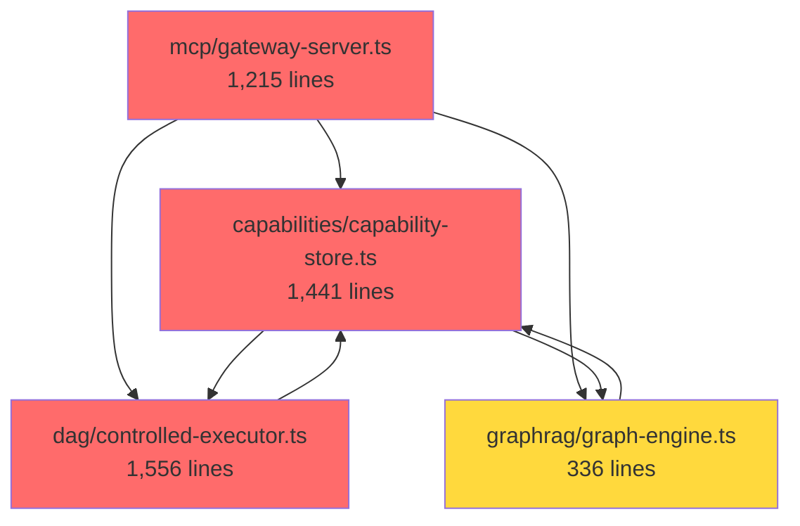

# Tech Spec: Architecture Refactoring - Phase 2

**Status:** Draft
**Priority:** P1 - High
**Created:** 2025-12-29
**Depends On:** `tech-spec-large-files-refactoring.md` (Phases 1-4 completed)

---

## Executive Summary

While Phases 1-4 of the large files refactoring successfully reduced file sizes, new architectural issues have emerged:

1. **New God Classes**: `static-structure-builder.ts` (2,399 lines) was not in scope
2. **File Re-inflation**: Some refactored files have grown back (controlled-executor: 841→1,556 lines)
3. **Type File Explosion**: `capabilities/types.ts` (1,237 lines), `graphrag/types.ts` (695 lines)
4. **Circular Coupling**: Bidirectional dependencies between `capabilities` ↔ `dag`, `mcp` → everything
5. **Missing Abstractions**: No interfaces, heavy coupling to concrete classes

This spec addresses these issues with a **surgical refactoring approach** to avoid breaking changes.

---

## Problem Statement

### Code Metrics Analysis (2025-12-29)

| File | Lines | Issues | Priority |
|------|-------|--------|----------|
| `static-structure-builder.ts` | 2,399 | Not in Phase 1-4 scope, SWC AST parsing logic mixed with graph building | **P0** |
| `controlled-executor.ts` | 1,556 | Re-inflated from 841 lines (Phase 3) | **P0** |
| `capability-store.ts` | 1,441 | Re-inflated from 1,052 lines (Phase 6 pending) | **P1** |
| `sandbox/executor.ts` | 1,302 | Phase 5 pending | **P1** |
| `gateway-server.ts` | 1,215 | Re-inflated from 496 lines (Phase 1) | **P0** |
| `capabilities/types.ts` | 1,237 | God object, git conflict magnet | **P1** |
| `graphrag/types.ts` | 695 | Coupling amplifier | **P2** |

### Architectural Issues

#### 1. Circular Dependencies (High Severity)

```
mcp/
  ├─→ capabilities (64 import statements)
  ├─→ dag (38 imports)
  └─→ graphrag

capabilities/
  ├─→ dag (forms circular dependency)
  └─→ mcp (for types)

dag/
  └─→ capabilities (forms circular dependency)
```

**Impact:**
- Cannot test modules in isolation
- Changes ripple across entire codebase
- TypeScript compilation order issues
- Runtime circular dependency risks

#### 2. Missing Abstraction Layer

**Current:** Direct class coupling
```typescript
import { CapabilityStore } from "../capabilities/capability-store.ts";
import { DAGExecutor } from "../dag/executor.ts";

class GatewayServer {
  constructor(
    private capStore: CapabilityStore,  // ❌ Concrete class
    private executor: DAGExecutor        // ❌ Concrete class
  ) {}
}
```

**Problems:**
- Cannot mock for testing
- Cannot swap implementations
- Tight coupling to database/infrastructure

#### 3. Type File Explosion

`capabilities/types.ts` contains **85+ types** across 6 domains:
- Capabilities (Capability, SaveCapabilityInput, CapabilityMatch, etc.)
- Execution (ExecutionTrace, TraceTaskResult, etc.)
- Permissions (PermissionSet, PermissionConfig, etc.)
- Static Analysis (StaticStructure, ArgumentsStructure, etc.)
- Graph (GraphNode, GraphEdge, etc.)
- Schemas (JSONSchema, etc.)

---

## Target Architecture

### Design Principles

1. **Strict Layering**: No upward dependencies
2. **Dependency Inversion**: Depend on interfaces, not implementations
3. **Type Modularity**: Max 300 lines per type file
4. **Single Responsibility**: One concern per class (target: <500 lines)

### Layered Architecture

```
┌─────────────────────────────────────────┐
│  Presentation Layer (mcp-server, web)  │  ← User-facing
├─────────────────────────────────────────┤
│  Application Layer (use-cases)          │  ← Business logic orchestration
├─────────────────────────────────────────┤
│  Domain Layer (entities, interfaces)    │  ← Core business logic
├─────────────────────────────────────────┤
│  Infrastructure (db, vector, events)    │  ← Technical implementations
└─────────────────────────────────────────┘

Rules:
- Each layer can ONLY depend on layers below
- NO circular dependencies between layers
- Infrastructure injects via interfaces (DI)
```

---

## Phase 2.1: Break Circular Dependencies (P0 - Critical)

### Step 1: Extract Core Domain Types

**Create:** `src/domain/types/`

```
src/domain/
├── types/
│   ├── capability.ts       # Capability, CapabilityMatch
│   ├── workflow.ts         # DAGStructure, Task, TaskResult
│   ├── execution.ts        # ExecutionTrace, ExecutionResult
│   ├── permission.ts       # PermissionSet, PermissionConfig
│   └── mod.ts              # Re-exports
```

**Migration:**
- Move shared types from `capabilities/types.ts`, `dag/types.ts`, `graphrag/types.ts`
- Update imports across codebase: `import type { Capability } from "@/domain/types/capability.ts"`
- Remove duplicate type definitions

**Acceptance Criteria:**
- [ ] No type file > 300 lines
- [ ] Zero circular type dependencies
- [ ] All imports use `import type { }` for types

### Step 2: Define Service Interfaces

**Create:** `src/domain/interfaces/`

```typescript
// src/domain/interfaces/capability-repository.ts
export interface ICapabilityRepository {
  save(capability: Capability): Promise<void>;
  findById(id: string): Promise<Capability | null>;
  findByIntent(intent: string): Promise<Capability[]>;
  updateUsage(id: string, success: boolean): Promise<void>;
}

// src/domain/interfaces/dag-executor.ts
export interface IDAGExecutor {
  execute(dag: DAGStructure, context?: ExecutionContext): Promise<DAGExecutionResult>;
  resume(workflowId: string): Promise<DAGExecutionResult>;
  abort(workflowId: string): Promise<void>;
}

// src/domain/interfaces/graph-engine.ts
export interface IGraphEngine {
  addToolDependency(from: string, to: string): Promise<void>;
  findRelatedTools(toolId: string, limit?: number): Promise<string[]>;
  suggestWorkflow(intent: string): Promise<DAGSuggestion>;
}
```

**Benefits:**
- `mcp/` imports interfaces, not implementations
- Test with mocks easily
- Swap implementations without changing consumers

**Acceptance Criteria:**
- [ ] Top 5 services have interfaces
- [ ] Gateway server depends only on interfaces
- [ ] Unit tests use mocked interfaces

### Step 3: Dependency Injection Setup

**Create:** `src/infrastructure/di/container.ts`

```typescript
import type { ICapabilityRepository } from "@/domain/interfaces/capability-repository.ts";
import type { IDAGExecutor } from "@/domain/interfaces/dag-executor.ts";
import { CapabilityStore } from "@/capabilities/capability-store.ts";
import { ControlledExecutor } from "@/dag/controlled-executor.ts";

export class DIContainer {
  private static instances = new Map<string, unknown>();

  static register<T>(key: string, factory: () => T): void {
    this.instances.set(key, factory());
  }

  static resolve<T>(key: string): T {
    return this.instances.get(key) as T;
  }

  // Convenience methods
  static getCapabilityRepository(): ICapabilityRepository {
    return this.resolve<ICapabilityRepository>("capability-repository");
  }

  static getDAGExecutor(): IDAGExecutor {
    return this.resolve<IDAGExecutor>("dag-executor");
  }
}

// Usage in main.ts
DIContainer.register("capability-repository", () => new CapabilityStore(db, embeddings));
DIContainer.register("dag-executor", () => new ControlledExecutor(toolExecutor, config));
```

**Acceptance Criteria:**
- [ ] DI container bootstraps all services
- [ ] No direct `new ClassName()` in business logic
- [ ] Test setup uses mock container

---

## Phase 2.2: Refactor God Classes (P0 - Critical)

### Target 1: `static-structure-builder.ts` (2,399 lines)

**Responsibilities Identified:**
1. SWC AST parsing (lines 1-800)
2. Node extraction (tool calls, decisions, fork/join) (lines 801-1400)
3. Edge generation (sequence, conditional, provides) (lines 1401-1800)
4. Argument extraction and resolution (lines 1801-2200)
5. Variable tracking and literal bindings (lines 2201-2399)

**Target Structure:**

```
src/capabilities/analysis/
├── static-structure-builder.ts  # ~300 lines - Facade orchestrator
├── parsers/
│   ├── ast-parser.ts             # SWC parsing wrapper
│   ├── node-extractor.ts         # Extract task/decision/fork nodes
│   └── argument-extractor.ts     # Extract arguments from AST
├── graph/
│   ├── edge-builder.ts           # Generate edges (sequence, conditional, provides)
│   └── scope-tracker.ts          # Track scopes for conditional edges
└── context/
    ├── variable-tracker.ts       # Map variables to node IDs
    └── literal-resolver.ts       # Resolve literal bindings
```

**Migration Strategy:**

1. **Week 1**: Extract AST parsing utilities
   - Create `parsers/ast-parser.ts` with SWC wrapper
   - Move `parse()` call and span extraction logic
   - Unit tests for parser module

2. **Week 2**: Extract node extraction
   - Create `parsers/node-extractor.ts`
   - Move `visitCallExpression`, `visitIfStatement`, etc.
   - Unit tests for each node type

3. **Week 3**: Extract edge generation
   - Create `graph/edge-builder.ts`
   - Move sequence/conditional/provides edge logic
   - Unit tests for edge generation

4. **Week 4**: Extract context tracking
   - Create `context/variable-tracker.ts` and `literal-resolver.ts`
   - Move variable binding and resolution logic
   - Integration tests for full flow

**Acceptance Criteria:**
- [ ] Main file < 300 lines (90% reduction)
- [ ] Each module independently testable
- [ ] Zero breaking changes to public API
- [ ] Test coverage > 85%

### Target 2: `controlled-executor.ts` (1,556 lines) - Re-inflation Fix

**Analysis:** File re-inflated from 841 → 1,556 lines since Phase 3

**New Bloat Sources:**
- Lines 1-200: Imports and setup (bloated)
- Lines 400-700: Speculation logic (should be in `speculation/`)
- Lines 900-1100: Permission escalation (should be in `permissions/`)
- Lines 1200-1400: Checkpoint logic (should be in `checkpoints/`)

**Re-refactoring Plan:**

1. **Move speculation logic**
   - Current: Inline in `execute()` method
   - Target: `src/dag/speculation/executor-integration.ts`
   - Extract: `handleSpeculativeExecution()`, `consumeSpeculation()`

2. **Move permission logic**
   - Current: Scattered across `executeTask()`
   - Target: `src/dag/permissions/escalation-manager.ts`
   - Extract: Permission checking, escalation request generation

3. **Consolidate checkpoint logic**
   - Current: `checkpoints/integration.ts` exists but underutilized
   - Target: Move ALL checkpoint calls to this module
   - Create: `CheckpointCoordinator` class to encapsulate logic

**Target:** Reduce to 600 lines (60% of current size)

**Acceptance Criteria:**
- [ ] File size < 600 lines
- [ ] No duplicate logic in extracted modules
- [ ] All existing tests pass
- [ ] Code review: single responsibility verified

### Target 3: `capability-store.ts` (1,441 lines)

**Current Responsibilities (6 domains):**
1. CRUD operations (save, find, update, delete)
2. Embedding generation
3. Schema inference
4. Dependency management
5. Trace storage
6. Code transformation

**Target Structure:**

```
src/capabilities/
├── capability-store.ts           # ~200 lines - Repository interface
├── storage/
│   ├── repository.ts             # CRUD operations
│   ├── query-builder.ts          # Complex queries (findByIntent, etc.)
│   └── embedding-indexer.ts      # Embedding generation and indexing
├── analysis/
│   ├── schema-analyzer.ts        # Schema inference (uses SchemaInferrer)
│   └── dependency-analyzer.ts    # Dependency graph building
└── tracing/
    └── trace-recorder.ts         # Execution trace storage
```

**Migration Strategy:**

1. Extract repository layer (pure CRUD)
2. Extract embedding indexing
3. Extract schema and dependency analysis
4. Create facade for backward compatibility

**Target:** Reduce to 200 lines (86% reduction)

**Acceptance Criteria:**
- [ ] File size < 200 lines
- [ ] Each module < 300 lines
- [ ] Existing tests pass
- [ ] New unit tests per module

---

## Phase 2.3: Split Type Files (P1 - High)

### Target: `capabilities/types.ts` (1,237 lines → 6 files)

**Current:** 85+ types in single file
**Target:** 6 domain-specific files

```
src/capabilities/types/
├── capability.ts         # ~150 lines
│   ├── Capability
│   ├── SaveCapabilityInput
│   ├── CapabilityMatch
│   ├── CapabilityFilters
│   └── CacheConfig
│
├── execution.ts          # ~200 lines
│   ├── ExecutionTrace
│   ├── TraceTaskResult
│   ├── SaveTraceInput
│   └── ExecutionResult
│
├── permission.ts         # ~180 lines
│   ├── PermissionSet
│   ├── PermissionConfig
│   ├── PermissionEscalationRequest
│   └── PermissionAuditLogEntry
│
├── static-analysis.ts    # ~250 lines
│   ├── StaticStructure
│   ├── StaticStructureNode
│   ├── StaticStructureEdge
│   ├── ArgumentsStructure
│   └── ArgumentValue
│
├── graph.ts              # ~180 lines
│   ├── GraphNode
│   ├── GraphEdge
│   ├── HypergraphOptions
│   └── CapabilityZone
│
├── schema.ts             # ~150 lines
│   ├── JSONSchema
│   ├── SchemaProperty
│   └── SchemaValidationResult
│
└── mod.ts                # Re-exports all types
```

**Migration Steps:**

1. Create new type files with domain grouping
2. Update imports in all consuming files
3. Delete old `types.ts`
4. Run type check: `deno task typecheck`

**Acceptance Criteria:**
- [ ] No type file > 300 lines
- [ ] Zero duplicate type definitions
- [ ] All files type-check successfully
- [ ] Import paths updated (use `@/capabilities/types/capability.ts`)

---

## Phase 2.4: Sandbox Executor Completion (P1 - High)

**Status:** Phase 5 from original spec, not yet started
**Current:** `src/sandbox/executor.ts` (1,302 lines)

Follow original Phase 5 plan from `tech-spec-large-files-refactoring.md`:

```
src/sandbox/
├── executor.ts                 # ~250 lines - Main executor
├── execution/
│   ├── deno-runner.ts          # Deno subprocess execution
│   ├── worker-runner.ts        # Worker-based execution (new default)
│   ├── result-parser.ts        # Output parsing
│   └── timeout-handler.ts      # Timeout management
├── security/
│   ├── permission-mapper.ts    # Permission set mapping
│   └── path-validator.ts       # Path validation
└── tools/
    └── injector.ts             # Tool injection logic
```

**Target:** Reduce to 250 lines (80% reduction)

---

## Implementation Timeline

### Sprint 1 (Weeks 1-2): Break Circular Dependencies
- **Week 1**: Extract domain types, create `src/domain/types/`
- **Week 2**: Define service interfaces, setup DI container

**Deliverables:**
- [ ] `src/domain/types/` with 5 type files
- [ ] `src/domain/interfaces/` with 3 interface files
- [ ] DI container bootstrapping in `main.ts`

### Sprint 2 (Weeks 3-5): Refactor God Classes
- **Week 3**: `static-structure-builder.ts` (parsers extraction)
- **Week 4**: `static-structure-builder.ts` (graph/context extraction)
- **Week 5**: `controlled-executor.ts` (re-inflation fix)

**Deliverables:**
- [ ] `static-structure-builder.ts` < 300 lines
- [ ] `controlled-executor.ts` < 600 lines
- [ ] Unit tests for all extracted modules

### Sprint 3 (Weeks 6-7): Complete Refactoring
- **Week 6**: `capability-store.ts` refactoring
- **Week 7**: Split type files, sandbox executor

**Deliverables:**
- [ ] `capability-store.ts` < 200 lines
- [ ] Type files split (no file > 300 lines)
- [ ] `sandbox/executor.ts` < 250 lines

### Sprint 4 (Week 8): Testing & Documentation
- Integration testing across all refactored modules
- Update architecture documentation
- Performance validation

**Deliverables:**
- [ ] Integration test suite passing
- [ ] Architecture diagrams updated
- [ ] Performance benchmarks (no regression)

---

## Risk Mitigation

### Risk 1: Breaking Changes

**Mitigation:**
- Maintain facade pattern for all refactored classes
- Deprecate old APIs gradually (with warnings)
- Comprehensive integration tests before/after

**Rollback Plan:**
- Feature flag: `ENABLE_REFACTORED_MODULES=true`
- Keep old implementations until validation complete

### Risk 2: Type Import Churn

**Impact:** 300+ files importing from `capabilities/types.ts`

**Mitigation:**
- Use import map in `deno.json`:
  ```json
  {
    "imports": {
      "@/types/capability": "./src/capabilities/types/capability.ts",
      "@/types/execution": "./src/capabilities/types/execution.ts"
    }
  }
  ```
- Mass import update via `deno task refactor:update-imports`

### Risk 3: Circular Dependency Uncovered

**Scenario:** DI setup reveals runtime circular dependency

**Mitigation:**
- Audit dependency graph before DI migration
- Use lazy loading for optional dependencies
- Break cycles with event bus pattern (already exists)

---

## Success Metrics

| Metric | Current | Target | Validation |
|--------|---------|--------|------------|
| **Max file size** | 2,399 lines | 600 lines | `wc -l src/**/*.ts` |
| **Circular deps** | 3+ cycles | 0 cycles | `deno info --json` analysis |
| **Type file size** | 1,237 lines | 300 lines | Manual inspection |
| **Interface coverage** | 0% | 80% | Count interfaces vs classes |
| **Test coverage** | ~60% | >85% | `deno task coverage` |
| **Build time** | ~45s | <50s | CI/CD metrics |

---

## Acceptance Criteria (Overall)

### Code Quality
- [ ] No file > 600 lines
- [ ] No type file > 300 lines
- [ ] Zero circular dependencies between modules
- [ ] All services implement interfaces

### Testing
- [ ] Unit test coverage > 85%
- [ ] Integration tests pass (existing + new)
- [ ] Performance tests: <5% regression

### Documentation
- [ ] Architecture diagrams updated
- [ ] Migration guide for developers
- [ ] ADR documenting DI pattern adoption

---

## Appendix A: Dependency Graph (Current)



**Legend:**
- 🔴 Red: > 1,000 lines
- 🟡 Yellow: 500-1,000 lines
- ↔️ Double arrow: Circular dependency

---

## Appendix B: Quick Wins (Can Start Immediately)

### QW-1: Split `capabilities/types.ts` (2-3 days)
- Low risk, high value
- No logic changes, just file organization
- Immediate reduction in git conflicts

### QW-2: Extract `controlled-executor` speculation logic (3-4 days)
- Module already exists: `dag/speculation/integration.ts`
- Move remaining inline speculation code
- Reduces main file by ~200 lines

### QW-3: Create service interfaces (1 week)
- No code changes required
- Foundation for DI and testing
- Enables parallel development on refactoring

---

## Next Steps

1. **Review & Approve**: Team reviews this spec
2. **Prioritize**: Confirm P0 items (circular deps + static-structure-builder)
3. **Spike**: 2-day spike on DI container pattern (validate approach)
4. **Start QW-1**: Begin with type file split (easy win)
5. **Kickoff Sprint 1**: Week 1 starts with domain types extraction

---

## References

- **Phase 1 Spec**: `docs/tech-specs/tech-spec-large-files-refactoring.md`
- **Architecture Audit**: [Generated 2025-12-29 by Claude Code]
- **ADR-036**: Event Bus pattern (for breaking cycles)
- **ADR-052**: Two-level DAG (logical/physical separation)
