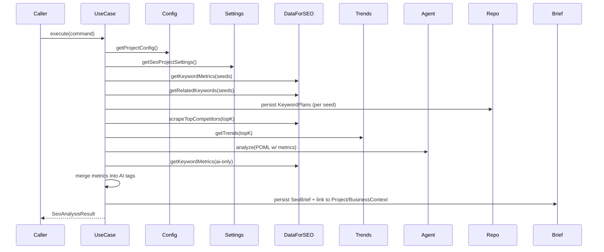

# SeoAnalysis Use Case

## Purpose
- **[goal]** Produce a data-driven SEO brief and keyword plan by combining real metrics (DataForSEO + SERP + Trends) with AI synthesis.
- **[scope]** Persist seeds/related keywords, create a `SeoBrief`, and return a consolidated `SeoAnalysisResult` to drive outline and article generation.

## Location
- **Use case**: `packages/application/src/usecases/seo-analysis/seo-analysis.usecase.ts`
- **Helpers**:
  - `PersistKeywordPlanUseCase`: `packages/application/src/usecases/persist-keyword-plan.usecase.ts`
  - `SeoBriefOrchestrator`: `packages/application/src/services/seo/seobrief-orchestrator.service.ts`
  - `SeoDataEnrichmentService`: `packages/application/src/services/seo/seo-data-enrichment.service.ts`
  - `TrendScoreService`: `packages/application/src/services/seo/trend-score.service.ts`

## Inputs (contract)
- **Command**: `SeoAnalysisCommand` (`@casys/core`)
  - `tenantId: string` (required)
  - `projectId: string` (required)
  - `language: string` (required)
  - `forceRegenerateKeywordPlans?: boolean` (default `false`)
- **ProjectConfig** (required fields)
  - `generation.seoAnalysis.template: string` (POML template path)
  - `generation.seoAnalysis.industry: string`
  - `generation.seoAnalysis.targetAudience: string`
- **ProjectSeoSettings** (VO)
  - `seedKeywords: string[]` (required, non-empty)
  - `contentType?: string`
  - `businessDescription?: string`

## Dependencies (ports)
- `UserProjectConfigPort`
- `ProjectSeoSettingsPort`
- `PromptTemplatePort`
- `SeoAnalysisAgentPort`
- `GoogleScrapingPort`
- `GoogleTrendsPort`
- `KeywordEnrichmentPort`
- `DomainAnalysisPort`
- `KeywordPlanRepositoryPort`
- Optional: `TagRepositoryPort`, `SeoBriefStorePort`

## Output (contract)
- `SeoAnalysisResult` (`@casys/core`), includes:
  - `keywordPlan.tags: KeywordTag[]` (with real metrics merged)
  - `searchIntent`
  - `competitors`
  - `trends`
  - `competitionScore`, `trendScore`
  - `analysisDate`, `dataSource`

## High-level Steps
1. **Load config**: `ProjectConfig`, `ProjectSeoSettings`; validate.
2. **Metrics (DataForSEO)**: `getKeywordMetrics(seeds)`.
3. **Seeds persistence**: `TagRepository.upsertProjectSeedTags()` (non-blocking warn on failure).
4. **Related keywords**: `getRelatedKeywords(seeds, depth)`; build `KeywordTagDTO` with metrics.
5. **Persist KeywordPlans**: per-seed via `PersistKeywordPlanUseCase` (idempotence by `seedNormalized`).
6. **SERP competitors**: scrape top for first `SERP_TOPK` seeds.
7. **Trends**: `GoogleTrendsPort` (fail-fast if missing).
8. **AI synthesis**: Build POML and call `SeoAnalysisAgentPort.analyze()`.
9. **Complete metrics for AI-only keywords**: fetch missing metrics and merge.
10. **Merge metrics into AI tags**: create enriched `KeywordTagDTO[]`.
11. **Create SeoBrief** (optional): via `SeoBriefOrchestrator.persistProjectBrief()`.
12. **Link SeoBrief to BusinessContext & Project**.
13. **Build and return `SeoAnalysisResult`.**

## Invariants & Fail-fast
- `tenantId`, `projectId`, `language` must be non-empty.
- `ProjectConfig` exists and `generation.seoAnalysis.template` is set.
- `seedKeywords` non-empty; `industry` and `targetAudience` present.
- Trends data required; throws if missing.
- External service failures (e.g., seed upsert, plan persist, brief linking) log warnings and continue when safe.

## Idempotency & Canonicalization
- **KeywordPlan reuse**: `getKeywordPlanBySeed({ seedNormalized })`.
- **Plan snapshot**: `planHash` for traceability.
- **KeywordTag identity**: use `slugifyKeyword()` and `buildKeywordTagId(tenantId, projectId, slug)` before writes/links.

## Persistence Notes (Neo4j)
- Always scope `:KeywordTag` by `tenant_id`, `project_id`.
- Use `MERGE` patterns with minimal matches and targeted `SET`.
- Unique constraints recommended (e.g., `KeywordTag.id`).

## Error Strategy
- Fail-fast for missing configuration and invalid inputs.
- Warn-and-continue for non-critical persistence steps.
- Typed/structured errors recommended for future hardening.

## Observability
- Structured logs per step with `tenantId`, `projectId`, `step`, `duration`.
- Include diagnostic logs for AI outputs and merged tags (counts, samples).

## Sequence Diagram

## Edge Cases
- No seeds configured → fail-fast.
- Empty AI tag list → fail-fast (invalid agent result).
- Trends unavailable → fail-fast.
- Partial DataForSEO failures → degrade gracefully (warn), still return result with available data.

## Testing Guidelines
- Unit tests per step (mocks): config validation, metrics fetch, related keywords, trends, AI result validation, merge logic.
- Integration test (mock ports) covering the happy path end-to-end.
- Assertions on:
  - Presence of metrics on AI-only keywords (completion step).
  - Idempotent behavior for existing KeywordPlans.

## Configuration
- Template path from `ProjectConfig.generation.seoAnalysis.template`.
- Tunables: `RELATED_KEYWORDS_DEPTH`, `SERP_TOPK` in `seo-analysis.usecase.ts`.

## Change Log (design)
- Added metrics completion for AI-only keywords before tag enrichment.
