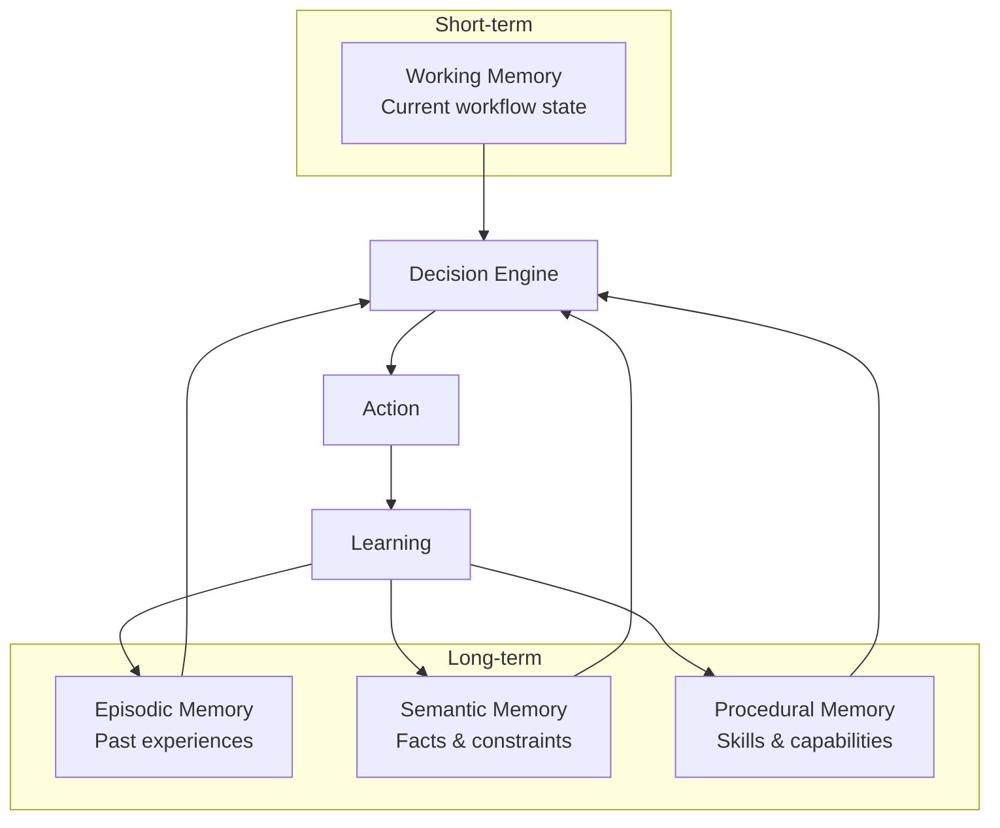
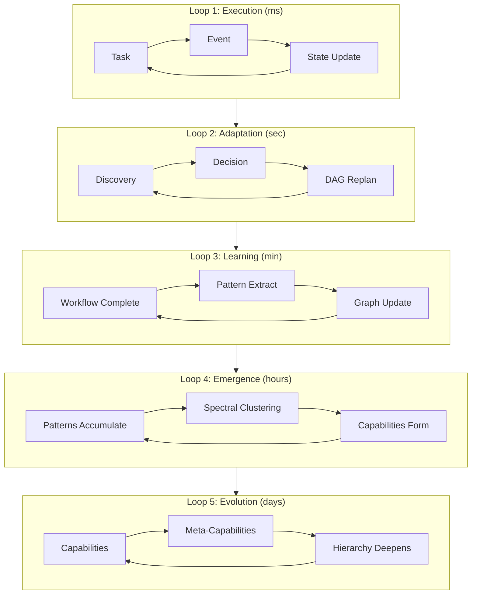
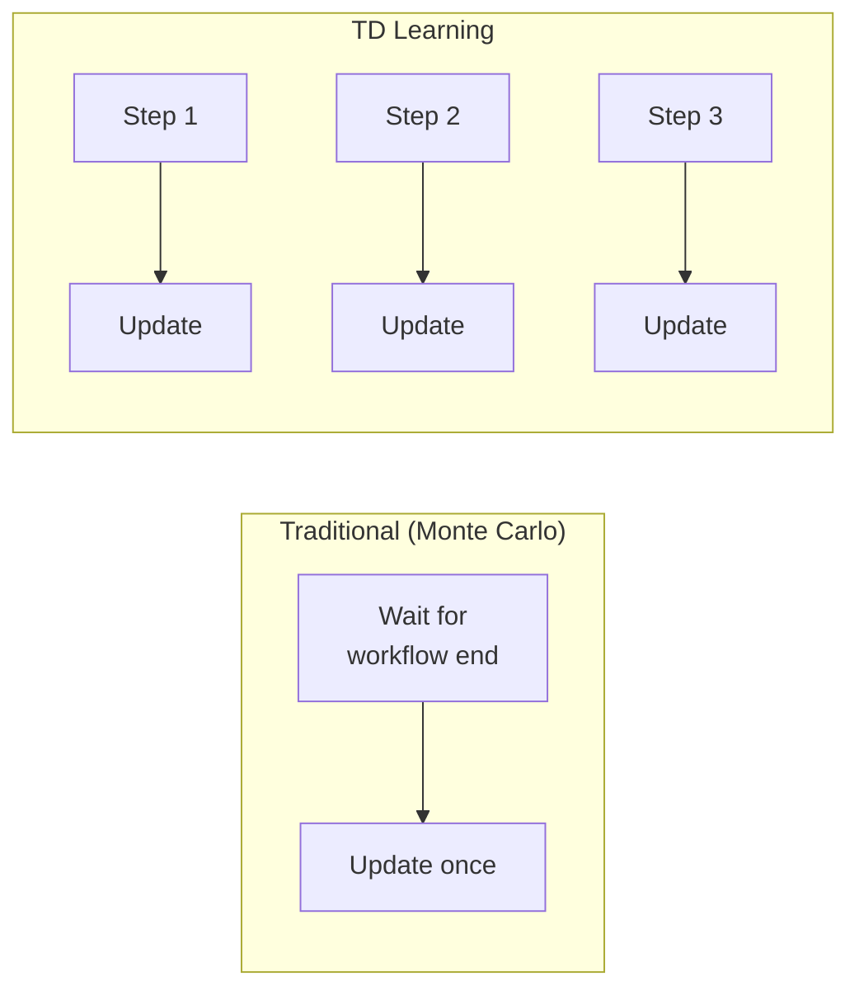

# Implementing CoALA: Cognitive Architecture for a Learning Agent

> From academic paper to production system: building memory and learning loops

## What Is CoALA?

**CoALA** (Cognitive Architectures for Language Agents) is a framework from Stanford that structures AI agents around three dimensions:

1. **Memory Modules** (Working + Long-term)
2. **Action Spaces** (External + Internal)
3. **Decision Procedures** (Planning → Execution)

We took this framework and built something more ambitious: **five feedback loops** instead of two, and **system-wide learning** instead of single-agent memory.

## The Four Memory Types

Like human cognition, Casys PML maintains four distinct memory systems:



### Working Memory
**What:** Current workflow state, active context, pending decisions.
**Storage:** In-memory (ephemeral).
**Access:** Every decision cycle.

```typescript
interface WorkflowState {
  messages: Message[];
  tasks: Task[];
  decisions: Decision[];
  context: ExecutionContext;
}
```

### Episodic Memory
**What:** Past experiences with outcomes.
**Storage:** PGlite (persistent).
**Access:** "Remember when this happened before?"

```typescript
interface EpisodicEvent {
  id: string;
  contextHash: string;
  toolsUsed: string[];
  outcome: 'success' | 'failure';
  timestamp: Date;
}
```

### Semantic Memory
**What:** Inferred facts, constraints, causal relationships.
**Storage:** PGlite (persistent).
**Access:** "Tool X requires Tool Y first."

```typescript
interface SemanticFact {
  type: 'constraint' | 'preference' | 'causal';
  subject: string;
  predicate: string;
  object: string;
  confidence: number;
}
```

### Procedural Memory
**What:** Learned skills (capabilities), tool patterns.
**Storage:** GraphRAG (SuperHyperGraph).
**Access:** "How do I deploy to production?"

## The Five Feedback Loops

Where CoALA has two loops, we have five—each operating at different timescales:



### Loop 1: Execution (milliseconds)
Real-time event-driven task execution.

### Loop 2: Adaptation (seconds)
Runtime DAG modification based on discoveries.

```typescript
// When a discovery happens mid-workflow
async replanDAG(discovery: Discovery): Promise<void> {
  const suggestions = await this.graphRAG.suggest(discovery.context);
  const approved = await this.decisionEngine.evaluate(suggestions);
  this.dag.injectNodes(approved);
}
```

### Loop 3: Learning (minutes)
Post-workflow graph updates.

```typescript
// After workflow completion
async learn(workflow: CompletedWorkflow): Promise<void> {
  const patterns = this.extractPatterns(workflow);
  await this.graphRAG.updateEdges(patterns);
  await this.pageRank.recompute();
}
```

### Loop 4: Emergence (hours)
Spectral clustering detects capability patterns.

### Loop 5: Evolution (days)
Meta-capabilities form from capability combinations.

## Learning Mechanisms

### Prioritized Experience Replay

Not all experiences are equal. We prioritize **surprising outcomes**:

```typescript
// Priority = prediction error
const priority = Math.abs(predictedSuccess - actualSuccess);

// Sample proportional to priority
const samples = buffer.sampleByPriority(batchSize);
```

Learning from mistakes is 2x more valuable than reinforcing successes.

### Temporal Difference Learning

Instead of waiting for complete workflows, we learn **step by step**:



Result: 5x faster adaptation.

### Adaptive Thresholds

Confidence thresholds self-adjust based on outcomes:

```typescript
// After each workflow step
const tdError = reward + gamma * nextValue - currentValue;
threshold -= learningRate * tdError;
threshold = clamp(threshold, 0.70, 0.95);
```

## The Result: System-Wide Meta-Learning

Unlike CoALA's single-agent focus, our learning is **cross-workflow and cross-user**:

| CoALA | Casys PML |
|-------|-----------|
| Agent learns from own experiences | System learns from all executions |
| Individual memory | Shared knowledge graph |
| Per-agent improvement | Global capability emergence |

When one user discovers a pattern, **everyone benefits**.

## Practical Impact

After implementing this architecture:

| Metric | Before | After |
|--------|--------|-------|
| Suggestion accuracy | 68% | 89% |
| Learning speed | ~50 workflows | ~10 steps |
| Capability discovery | Manual | Automatic |
| Cross-user learning | None | Full |

---

## References

- Sumita, M. et al. (2023). "CoALA: Cognitive Architectures for Language Agents." arXiv:2309.02427.
- Schaul, T. et al. (2015). "Prioritized Experience Replay." arXiv:1511.05952.
- Sutton, R. S. (1988). "Learning to Predict by Temporal Differences." *Machine Learning*, 3(1), 9-44.

#CoALA #CognitiveArchitecture #MachineLearning #CasysPML
