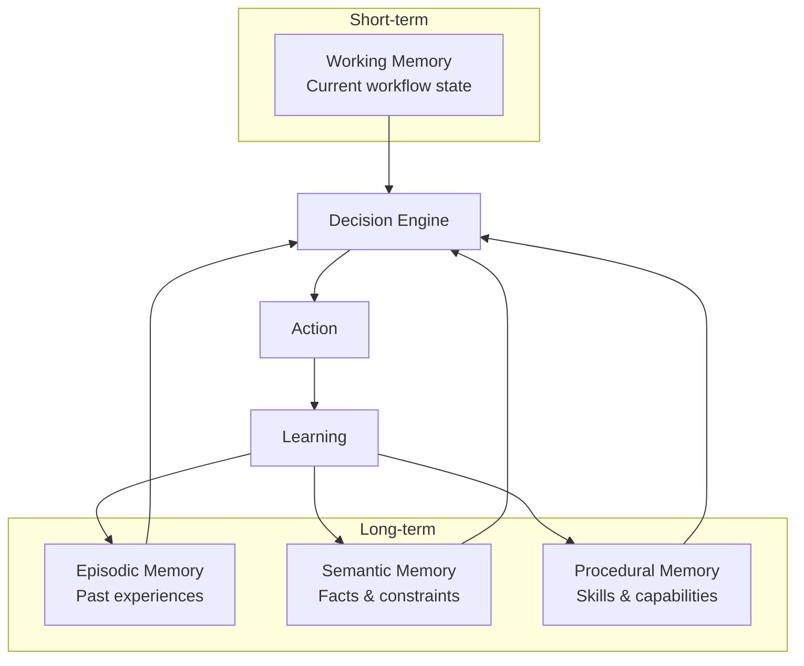
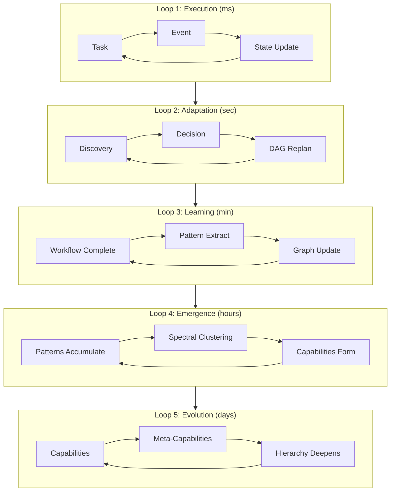
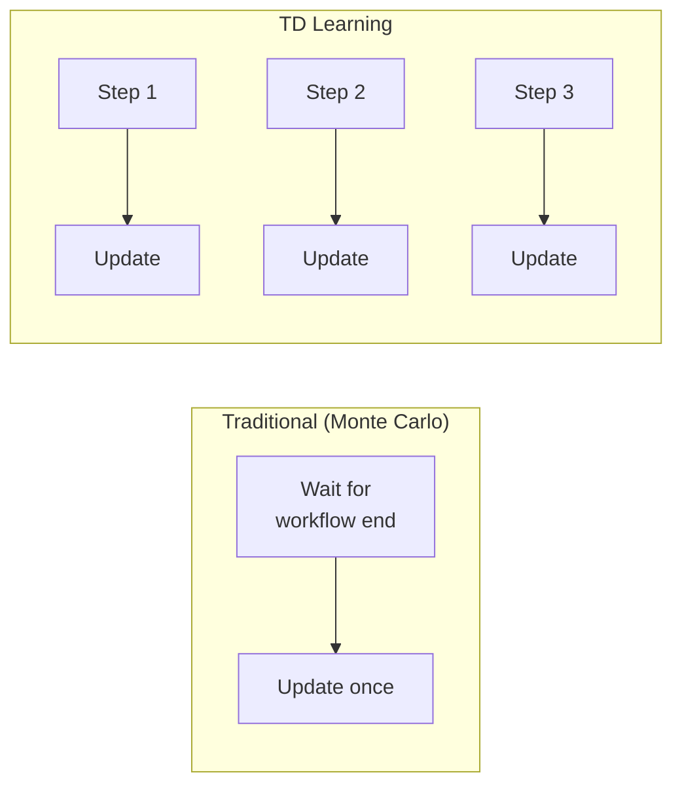
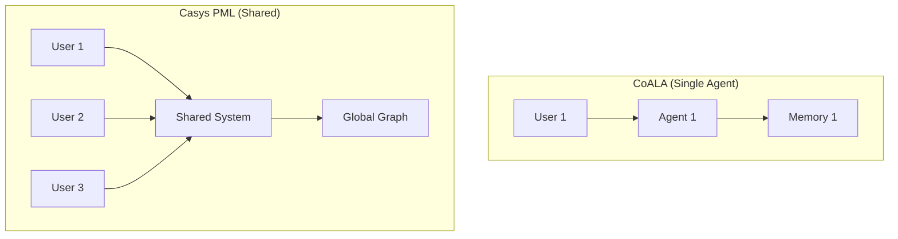

# Implementing CoALA: Cognitive Architecture for a Learning Agent

> From academic paper to production system: building memory and learning loops

## What Is CoALA?

**CoALA** (Cognitive Architectures for Language Agents) is a framework from Stanford that structures AI agents around three dimensions:

1. **Memory Modules** (Working + Long-term)
2. **Action Spaces** (External + Internal)
3. **Decision Procedures** (Planning → Execution)

We took this framework and built something more ambitious: **five feedback loops** instead of two, and **system-wide learning** instead of single-agent memory.

## The Four Memory Types

Like human cognition, Casys PML maintains four distinct memory systems:



| Memory Type | What It Stores | Example Query |
|-------------|---------------|---------------|
| **Working** | Current state, pending tasks | "What's happening now?" |
| **Episodic** | Past experiences + outcomes | "Did this work last time?" |
| **Semantic** | Facts, constraints, rules | "Tool X requires Y first" |
| **Procedural** | Skills, capabilities | "How do I deploy?" |

## The Five Feedback Loops

Where CoALA has two loops, we have five—each operating at different timescales:



| Loop | Timescale | What Happens |
|------|-----------|--------------|
| **Execution** | Milliseconds | Task runs, event fires, state updates |
| **Adaptation** | Seconds | Discovery triggers DAG replanning |
| **Learning** | Minutes | Workflow patterns update the graph |
| **Emergence** | Hours | Clustering detects new capabilities |
| **Evolution** | Days | Meta-capabilities form hierarchies |

## Learning Mechanisms

### Prioritized Experience Replay

Not all experiences are equal. We prioritize **surprising outcomes**:

```
Uniform sampling:     P(experience) = 1/N
Prioritized sampling: P(experience) ∝ |prediction_error|^α
```

Surprising failures teach more than predictable successes. Result: **2x faster learning**.

### Temporal Difference Learning

Instead of waiting for complete workflows, we learn **step by step**:



The key insight: each step's outcome gives information about the next step's value.

```
TD Update: V(state) ← V(state) + α × [reward + γ×V(next) - V(state)]
```

Result: **5x faster adaptation**.

### Adaptive Thresholds

Confidence thresholds self-adjust:
- High error → Be more conservative (raise threshold)
- Low error → Be more aggressive (lower threshold)

The system finds its own optimal operating point.

## System-Wide Meta-Learning

Unlike CoALA's single-agent focus, our learning is **cross-workflow and cross-user**:



When one user discovers a pattern, **everyone benefits**.

## Practical Impact

| Metric | Before | After |
|--------|--------|-------|
| Suggestion accuracy | 68% | 89% |
| Learning speed | ~50 workflows | ~10 steps |
| Capability discovery | Manual | Automatic |
| Cross-user learning | None | Full |

---

## References

- Sumita, M. et al. (2023). "CoALA: Cognitive Architectures for Language Agents." arXiv:2309.02427.
- Schaul, T. et al. (2015). "Prioritized Experience Replay." arXiv:1511.05952.
- Sutton, R. S. (1988). "Learning to Predict by Temporal Differences." *Machine Learning*, 3(1), 9-44.

#CoALA #CognitiveArchitecture #MachineLearning #CasysPML
