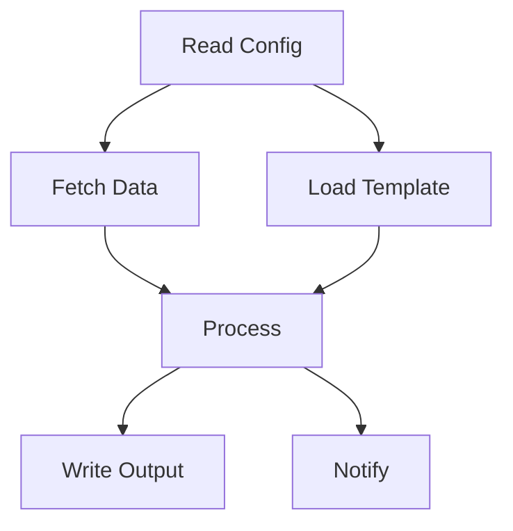
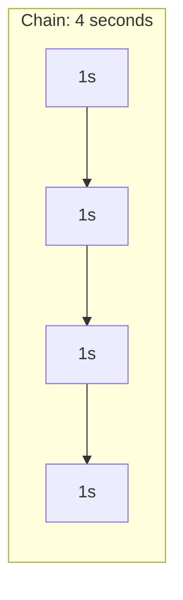
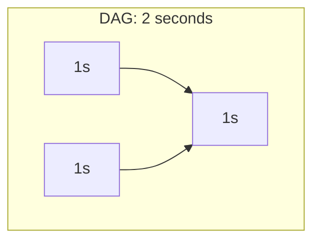

# DAG vs Chain Workflows: Why Graphs Beat Lines

> Simple is good. But sometimes simple is too simple.

## The Chain Model

TODO: Explain linear workflows
- Step 1 → Step 2 → Step 3 → Done
- Simple to understand
- Easy to implement

**Problem:** Everything is sequential, even when it doesn't need to be.

## The DAG Model

TODO: Explain DAG workflows
- Steps can have multiple predecessors
- Steps can have multiple successors
- Only true dependencies create edges

## Why DAGs Win

### 1. Parallelism

TODO: Independent tasks run simultaneously

### 2. Replanning

TODO: Insert nodes mid-execution
- Chain: break everything
- DAG: add node, reconnect edges

### 3. Resilience

TODO: Partial failures
- Chain: one failure stops everything
- DAG: independent branches continue

### 4. Observability

TODO: See what's running, what's blocked
- Clear dependency visualization
- Easy to identify bottlenecks

## The Complexity Trade-off

| Aspect | Chain | DAG |
|--------|-------|-----|
| Mental model | Simple | Medium |
| Implementation | Easy | Moderate |
| Parallelism | None | Full |
| Replanning | Hard | Easy |
| Debugging | Linear | Graph-aware needed |

## When To Use Each

TODO: Decision guide
- **Chain:** Simple scripts, strictly sequential logic
- **DAG:** Real workflows, multiple independent operations

## Our Implementation

TODO: How we handle DAGs
- Task dependencies as edges
- Topological sort for execution order
- Parallel dispatch for independent nodes

---

## References

- Airflow, Prefect, Dagster as DAG workflow examples
- Internal: Workflow execution engine

#DAG #Workflows #Parallelism #Architecture
