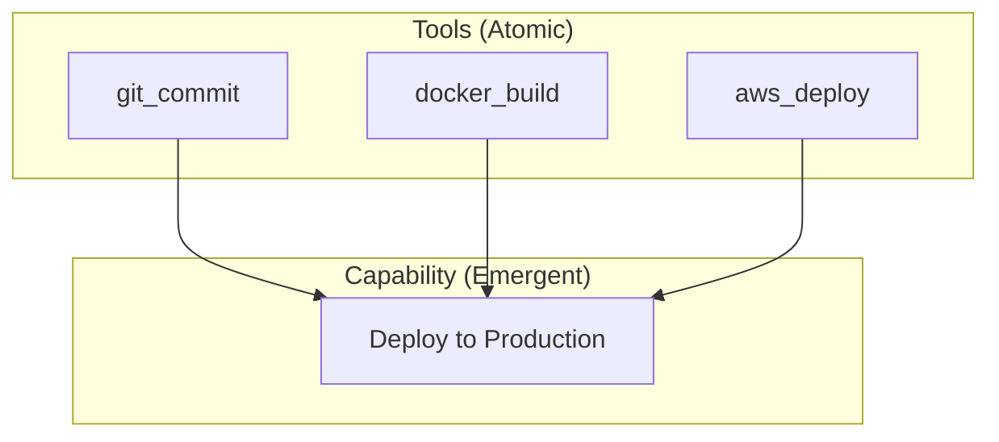
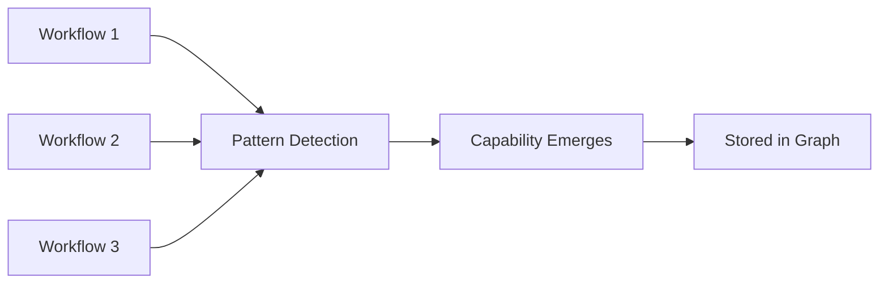

# Emergent Capabilities: When AI Agents Learn Skills Nobody Programmed

> The magic of self-organizing systems

## What Is a Capability?

TODO: Define capability vs tool
- Tool = atomic action (read file, push to git)
- Capability = coordinated pattern (deploy workflow)

## How Capabilities Emerge

TODO: The detection process
1. Track tool co-occurrence
2. Detect repeated patterns
3. Cluster similar patterns
4. Name and store as capability

## The Spectral Clustering Magic

TODO: How we detect clusters
- Build tool co-occurrence matrix
- Compute graph Laplacian
- Find eigenvectors
- K-means on spectral embedding

## From Capabilities to Meta-Capabilities

TODO: Recursive emergence
- Capabilities can contain other capabilities
- n-SuperHyperGraph structure
- Unbounded depth

## Real Examples

TODO: Show actual emerged capabilities from usage

| Emerged Capability | Tools Involved | Detection Confidence |
|-------------------|----------------|---------------------|
| "Git Workflow" | git_add, git_commit, git_push | 0.94 |
| "Test Suite" | jest_run, coverage_check | 0.91 |
| "Deploy AWS" | docker_build, ecr_push, ecs_update | 0.88 |

## Why This Matters

TODO: Benefits of emergence vs explicit programming
- No manual capability definition
- Adapts to user patterns
- Discovers unexpected combinations

---

## References

- Internal: ADR-029 - Capability Emergence
- See also: [n-SuperHyperGraph](/blog/why-n-superhypergraph)

#Emergence #Capabilities #SelfOrganization #AILearning
