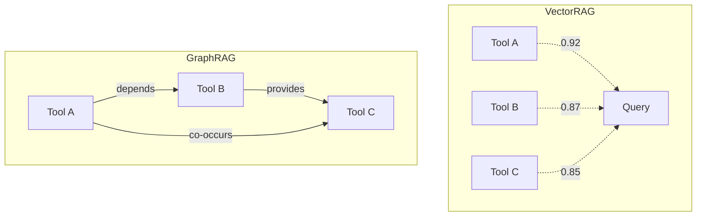

# GraphRAG vs VectorRAG: Why Relationships Matter More Than Similarity

> Finding similar isn't the same as finding related

## The VectorRAG Approach

TODO: Explain traditional vector RAG
- Embed documents/chunks
- Query by similarity
- Return top-k matches

## The Problem for AI Agents

TODO: Why similarity isn't enough
- Tools have relationships, not just content
- "Similar" tools aren't necessarily "compatible" tools
- Execution order matters

## Enter GraphRAG

TODO: How graph-based retrieval works
- Nodes = tools/capabilities
- Edges = relationships (co-occurrence, dependency, provides)
- Query = graph traversal, not vector search

## Why Not Both?

TODO: Our hybrid approach
- Semantic similarity for initial matching
- Graph structure for relationship understanding
- PageRank for importance weighting

## Practical Comparison

| Aspect | VectorRAG | GraphRAG |
|--------|-----------|----------|
| Query type | "Find similar" | "Find related" |
| Captures | Content similarity | Structural relationships |
| Good for | Document retrieval | Tool orchestration |
| Misses | Execution order | Semantic nuance |

## Our Implementation

TODO: Link to ADR, code examples

---

## References

- TODO: Add academic references
- Internal: ADR-038 - Two-Layer Discovery Architecture

#GraphRAG #VectorRAG #KnowledgeGraph #AIArchitecture
