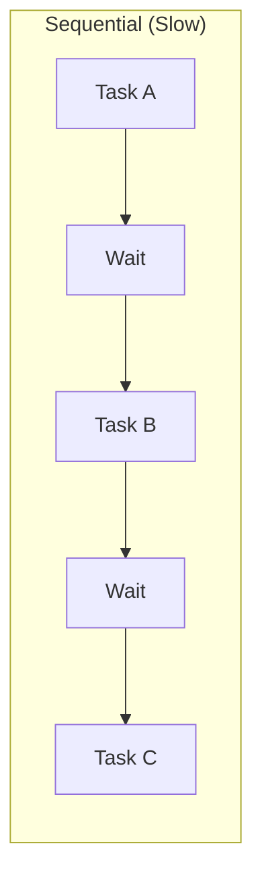
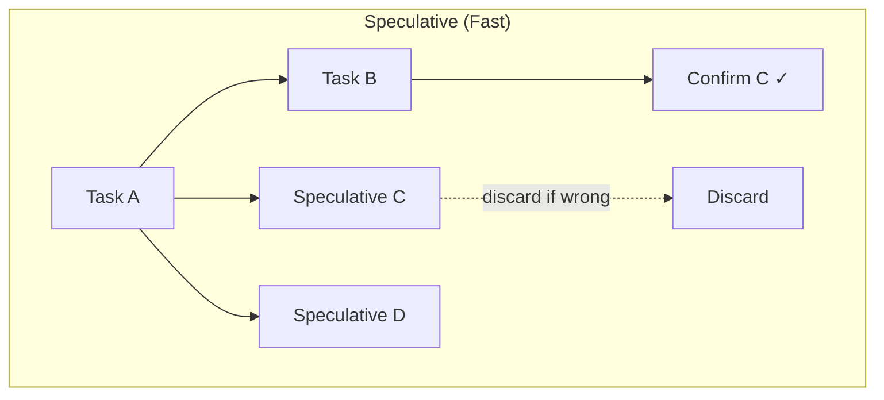
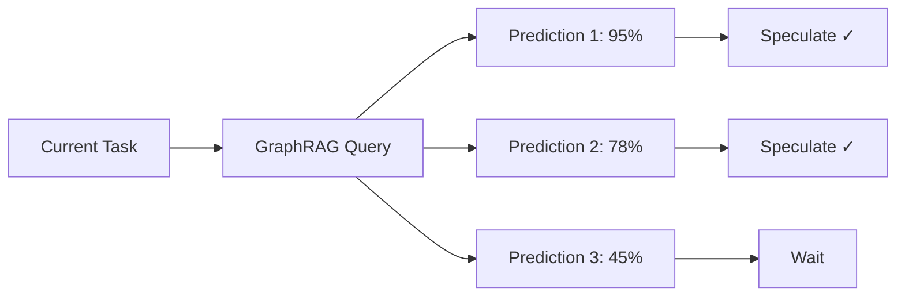

# Speculative Execution: Running Tasks Before You Know You Need Them

> Betting on the future to win time in the present

## The Waiting Problem

TODO: Explain the latency issue
- Sequential execution: wait for each step
- LLM calls are slow (~500ms-2s each)
- Most time spent waiting, not working

## The Speculation Idea

TODO: Core concept
- Predict what's likely needed next
- Start those tasks before confirmation
- If prediction correct: time saved
- If wrong: discard and continue

## When To Speculate

TODO: Prediction confidence
- High confidence (>90%): Speculate immediately
- Medium (70-90%): Speculate if resources available
- Low (<70%): Wait for confirmation

| Confidence | Action | Risk |
|------------|--------|------|
| >90% | Speculate | Low waste |
| 70-90% | Conditional | Moderate |
| <70% | Wait | None |

## The GraphRAG Advantage

TODO: Why our approach works well
- Graph knows likely sequences
- PageRank indicates importance
- Historical patterns guide predictions

## Handling Wrong Predictions

TODO: Rollback strategy
- Sandbox execution
- No side effects until confirmed
- Clean discard on misprediction

## Performance Impact

TODO: Real numbers

| Metric | Without Speculation | With Speculation |
|--------|--------------------|--------------------|
| Average workflow time | 12s | 4s |
| Wasted computation | 0% | ~15% |
| Net time saved | - | 67% |

The trade-off: spend 15% more compute to save 67% time.

---

## References

- CPU speculation (branch prediction) as inspiration
- Internal: ADR on speculative execution

#Performance #Speculation #Optimization #Parallelism
