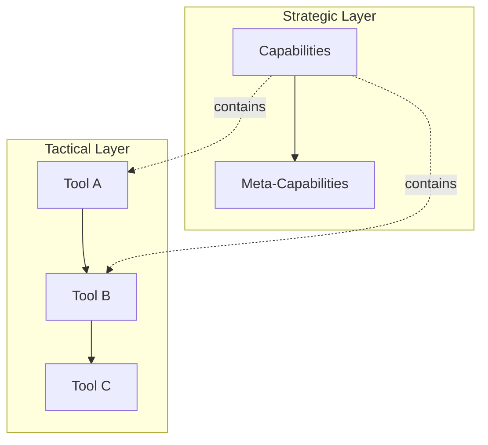
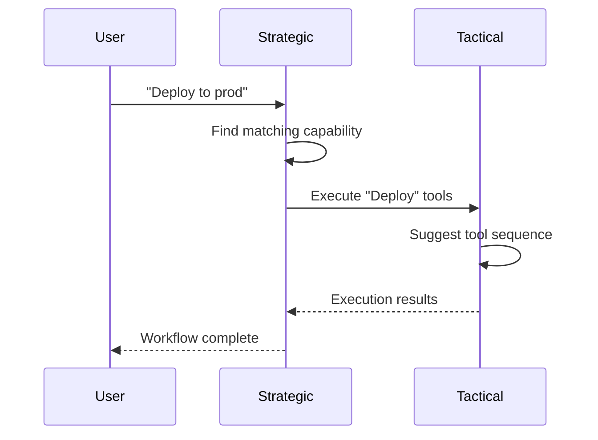

# Two-Layer Architecture: Separating Tactical and Strategic Intelligence

> Different questions need different data structures

## The Problem With Single-Layer Approaches

TODO: Why one graph isn't enough
- Tool-level decisions need different data than capability-level
- Mixing concerns creates complexity
- Different update frequencies

## The Two Layers

### Tactical Layer (Tools)

TODO: Describe tactical layer
- Simple graph structure
- Tool-to-tool relationships
- Fast, real-time decisions
- Algorithms: Semantic similarity, Adamic-Adar, Louvain clustering

| Aspect | Details |
|--------|---------|
| Nodes | Individual tools |
| Edges | Co-occurrence, dependency |
| Query | "What tool next?" |
| Speed | Milliseconds |

### Strategic Layer (Capabilities)

TODO: Describe strategic layer
- SuperHyperGraph structure
- Capability-to-capability relationships
- Slower, deliberate decisions
- Algorithms: PageRank, Spectral clustering, SHGAT (future)

| Aspect | Details |
|--------|---------|
| Nodes | Capabilities, Meta-capabilities |
| Edges | Contains, provides, sequence |
| Query | "What skill applies?" |
| Speed | Seconds |

## How They Interact

TODO: Cross-layer communication
- Strategic suggests capability
- Tactical executes tools within capability
- Results bubble up to strategic

## Why This Matters

TODO: Benefits of separation
- Cleaner code
- Independent optimization
- Different caching strategies
- Easier testing

## Implementation Details

TODO: Link to ADR-038, code structure

---

## References

- Internal: ADR-038 - Two-Layer Discovery Architecture
- See also: [n-SuperHyperGraph](/blog/why-n-superhypergraph)

#Architecture #TwoLayer #SystemDesign #AIAgents
