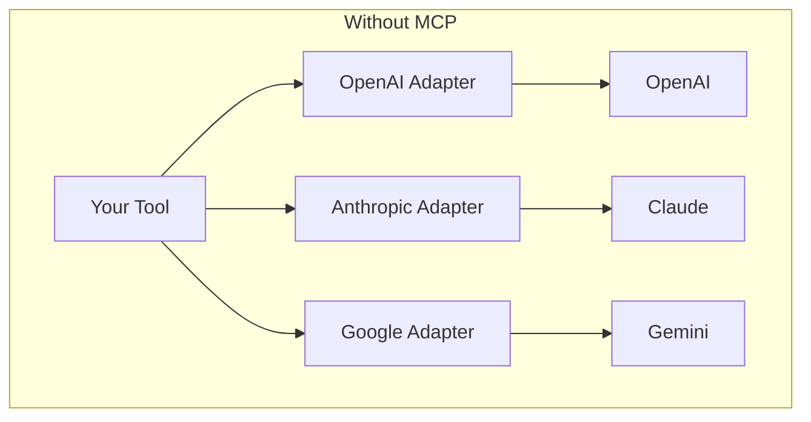
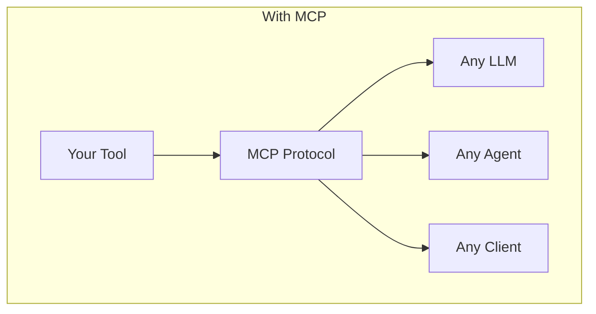
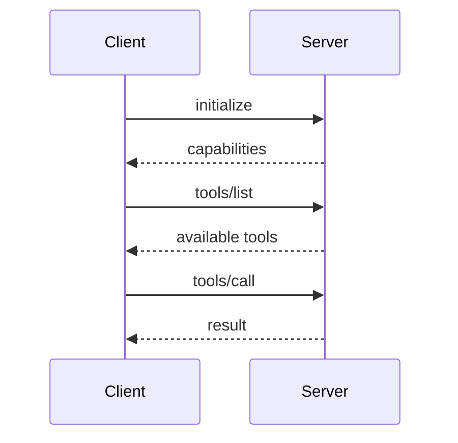

# Why MCP Protocol: The Universal Language for AI Tools

> From vendor lock-in to universal interoperability

## The Problem With Function Calling

TODO: Explain the fragmentation
- OpenAI has function calling
- Anthropic has tool use
- Google has function declarations
- Each slightly different, all proprietary

## What Is MCP?

TODO: Explain Model Context Protocol
- Open standard by Anthropic
- JSON-RPC based
- Tools, Resources, Prompts

## Why We Chose MCP

TODO: Our reasoning
- Vendor independence
- Growing ecosystem
- Clean separation of concerns
- Stdio transport = works everywhere

| Approach | Pros | Cons |
|----------|------|------|
| Native function calling | Tight integration | Vendor lock-in |
| Custom adapters | Full control | Maintenance burden |
| **MCP** | Universal, growing ecosystem | Newer, evolving |

## The MCP Architecture

TODO: How it works
- Server exposes tools
- Client discovers and calls
- Transport agnostic (stdio, HTTP, WebSocket)

## Practical Benefits

TODO: What we get
- Swap LLMs without rewriting tools
- Share tools across projects
- Community tool ecosystem

---

## References

- [Model Context Protocol Specification](https://modelcontextprotocol.io)
- Internal: Our MCP server implementation

#MCP #Protocol #Interoperability #AITools
